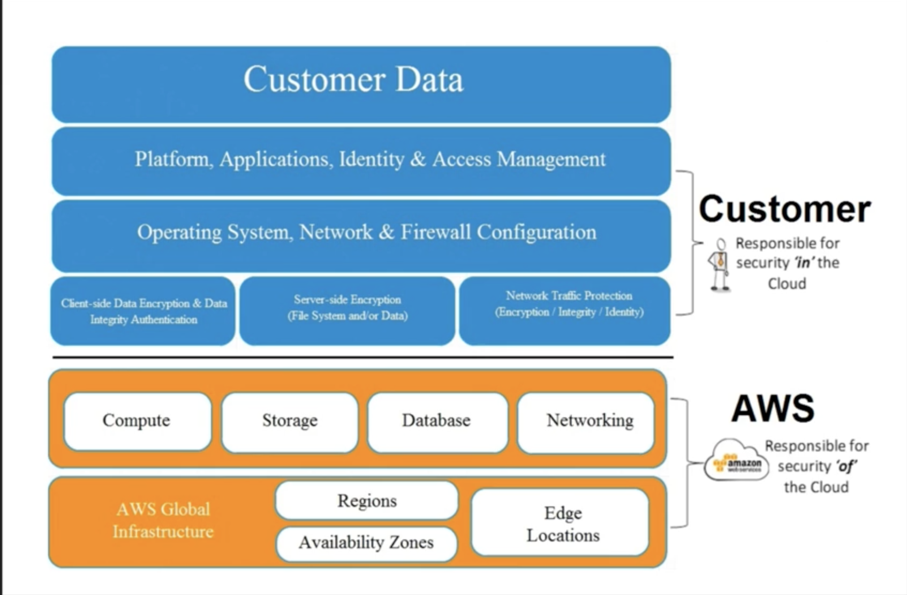

# Well Architected Framework - Pillar One Security

## Design Principles 

* Apply security at all layers
* Enable traceability
* Automate responses to security events
* Focus on securing your system
* Automate security best practices 


## AWS Shared Responsibility Model



## Definition

### Security in the cloud consists of 4 areas;  

* **Data protection** 
* **Privilege management** 
* **Infrastructure protection**
* **Detective controls**

## Best Practices - Data Protection

* Before you begin to architect security practices across your environment, basic data classification should be in place. 
* You should organize and classify your data in to segments such as `publicly available`, available to `only members of your organization`, available to `only certain members of your organization`, available only to the `board` etc. 
* You should also implement a least privilege access system so that people are only able to access what they need. 
* However most importantly, **you should encrypt everything where possible, whether it be at rest or in transit.**  

### In AWS the following practices help to protect your data;

* #### AWS customers maintain full control over their data. 
 
* AWS makes it easier for you to encrypt your data and manage keys, including regular key rotation, which can be easily automated natively by AWS or maintained by a customer. 
 
* Detailed logging is available that contains important content, **such as file access and changes**. 
 
* AWS has designed storage systems for exceptional resiliency. As an example, Amazon Simple Storage Service (S3) is designed for 11 nines of durability. (For example, if you store 10,000 objects with Amazon S3, you can on average expect to incur a loss of a single object once every 10,000,000 years.) 

* **Versioning**, which can be part of a larger data lifecycle-management process, can protect against accidental overwrites deletes, and similar harm.

* **AWS never initiates the movement of data between regions**. **Content placed in a region will remain in that region unless the customer explicitly enable a feature** or leverages a service that provides that functionality. 


## Best Practices - Data Protection Questions 

* How are you encrypting and protecting your data at rest? 
* How are you encrypting and protecting your data in transit? (SSL) 

**SSL certificate.**


## Best Practices - Privilege Management 

Privilege Management ensures that only **authorized and authenticated users** are able to access your resources, and only in a manner that is intended. It can include 
 
* Access Control Lists (ACLs) 
* Role Based Access Controls 
* Password Management (such as password rotation policies)


## Best Practices - Privilege Management Questions 

### How are you protecting access to and use of the AWS root account credentials? 

```
Enable Multi-Factor Authentication(MFA) in your account
```

### How are you defining roles and responsibilities of system users to control human access to the AWS Management Console and APIs?

```
SET GROUPS
group: system admin
group: tools
Exp: Separate groups for HR to access s3 bucket other than system admin
```

### How are you limiting automated access (such as from applications, scripts, or third-party tools or services) to AWS resources? 

```
IAM roles
```

### How are you managing keys and credentials? 

```
AWS Key Management Service (KMS)
```

## Best Practices - Infrastructure Protection

Outside of Cloud, this is how you protect your data center. RFID controls, security, lockable cabinets, CCTV etc. Within AWS they handle this, **so really Infrastructure protection exists at a VPC level**. 

## Best Practices - Infrastructure Protection Questions 

### How are you enforcing network and host-level boundary protection? 

```
VPC / sg / ACL / public subnet / private subnet / bastion host
```

### How are you enforcing AWS service level protection?

```
IAM
user account, group for users, password protection, password rotation policy
```

### How are you protecting the integrity of the operating systems on your Amazon EC2 instances? 

```
Anti-virus installed?
```

## Best Practices - Detective Controls 

### You can use detective controls to detect or identify a security breach. 

AWS Services to achieve this include; 

* AWS CloudTrail 
* Amazon CloudWatch
* AWS Config
* Amazon Simple Storage Service (S3) 
* Amazon Glacier
 
 
## Best Practices - Detective Control Questions 

### How are you capturing and analyzing AWS logs? 

```
log trails turns on  other logs management system
```


## Key AWS Services 

### Data protection 

You can encrypt your data both in transit and at rest using; ELB, EBS, S3 & RDS 

### Privilege management

IAM, MFA (Multi-Factor Authentication)

### Infrastructure protection

VPC

### AWS Cloud Trail

AWS Cloud Trail, AWS Config, Amazon Cloud Watch


## Exam Tips - Security Pillar

### Security in the cloud consists of 4 areas;  

* **Data protection** 
* **Privilege management** 
* **Infrastructure protection**
* **Detective controls**

## Exam Tips - Security Pillar -Questions

### Data Protection Questions 

* How are you encrypting and protecting your data at rest? 
* How are you encrypting and protecting your data in transit? (SSL) 

### Privilege Management Questions 

#### How are you protecting access to and use of the AWS root account credentials? 

```
Enable Multi-Factor Authentication(MFA) in your account
```

#### How are you defining roles and responsibilities of system users to control human access to the AWS Management Console and APIs?

```
SET GROUPS
group: system admin
group: tools
Exp: Separate groups for HR to access s3 bucket other than system admin
```

#### How are you limiting automated access (such as from applications, scripts, or third-party tools or services) to AWS resources? 

```
IAM roles
```

#### How are you managing keys and credentials? 

```
AWS Key Management Service (KMS)
```

### Infrastructure Protection Questions 

#### How are you enforcing network and host-level boundary protection? 

```
VPC / sg / ACL / public subnet / private subnet / bastion host
```

#### How are you enforcing AWS service level protection?

```
IAM
user account, group for users, password protection, password rotation policy
```

#### How are you protecting the integrity of the operating systems on your Amazon EC2 instances? 

```
Anti-virus installed?
```

### Detective Control Questions 

#### How are you capturing and analyzing AWS logs? 

```
log trails turns on  other logs management system
```


