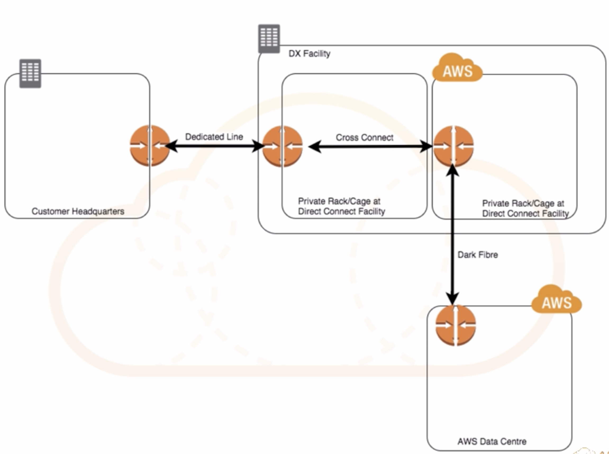

# Direct Connection

## What is Direct Connect

#### AWS Direct Connect makes it easy to establish a dedicated network connection from your premises to AWS.

**Using AWS Direct Connect, you can establish private connectivity between AWS and your datacenter, office, or colocation environment,** which in many cases can reduce your network costs, increase bandwidth throughput, and provide a more consistent network experience than Internet-based connections. 

## How is Direct Connect different from a VPN? 

### VPN Connections

* Can be configured in minutes and are a good solution if you have an immediate need, 
* Have low to modest bandwidth requirements, 
* Can tolerate the **inherent variability in Internet-based connectivity**.

### AWS Direct Connect

* Does not involve the Internet; 
* Instead, it uses dedicated, private network connections between your Intranet and Amazon VPC. 

## Direct Connect Connections 

### Available in

* 10Gbps 
* 1Gbps 
* Sub 1 Gbps can be purchased through AWS Direct 
* Connect Partners 0 
* Uses Ethernet ULAN trunking (802.1Q) 

