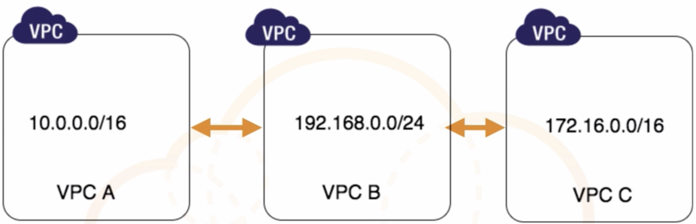
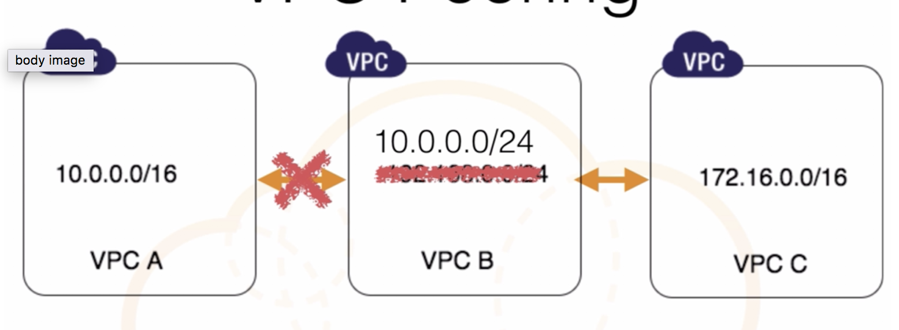
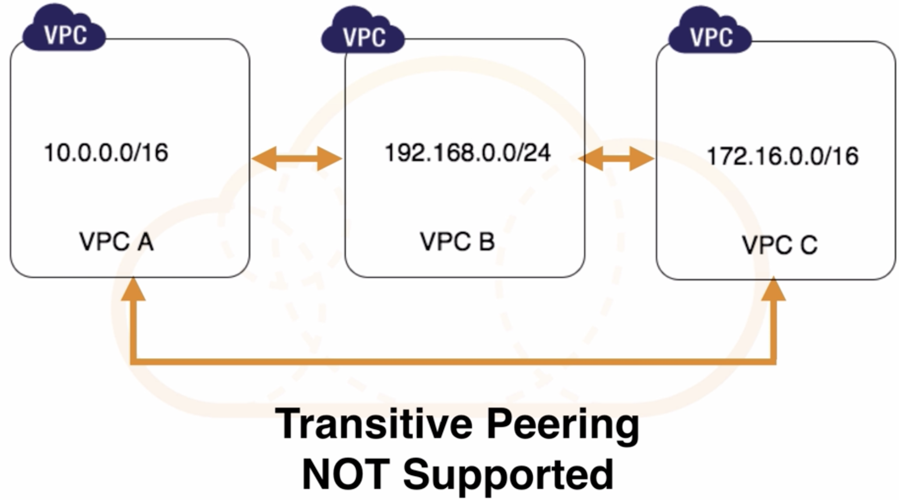

# VPC peering

## What is VPC Peering? 

### VPC Peering is simply a connection between two VPCs that enables you to route traffic between them using `private IP addresses`. 

Instances in either VPC can communicate with each other as if they are within the same network. 

### You can create a VPC peering connection between your own VPCs, or with a VPC in another AWS account within different VPC regions

[Announcing Support for Inter-Region VPC Peering](https://aws.amazon.com/about-aws/whats-new/2017/11/announcing-support-for-inter-region-vpc-peering/)

AWS uses the existing infrastructure of a VPC to create a VPC peering connection; it is neither a gateway nor a VPN connection, **and does not rely on a separate piece of physical hardware**. There is no single point of failure for communication or a bandwidth bottleneck. 

## VPC peering

**Instances within VPC A can communicate with instances within VPC B directly**

**In this situation, with same internal address range, basically share and overlap CIDR, instances within VPC A and B are no longer be able to peer and talk to each other**

**Instance within VPC A cannot communicate with instance within VPC C, they are not directly peered**

## Exam Tips - VPC Peering Limitations

* **You cannot** create a VPC peering connection between VPCs that have matching or overlapping CIDR blocks.
* You **CAN** create a VPC peering connection between VPCs in different regions
* PC peering **does not support transitive peering relationships** 

