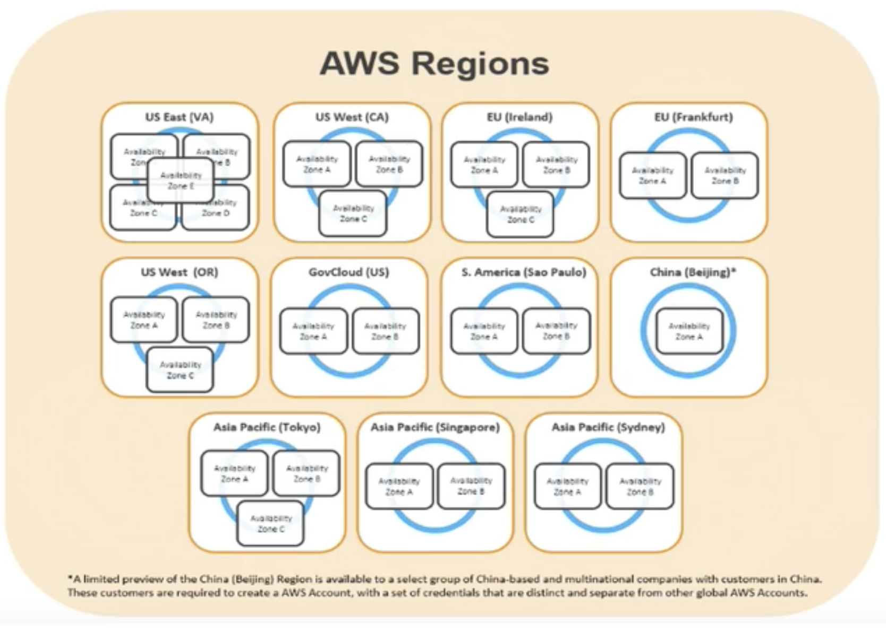
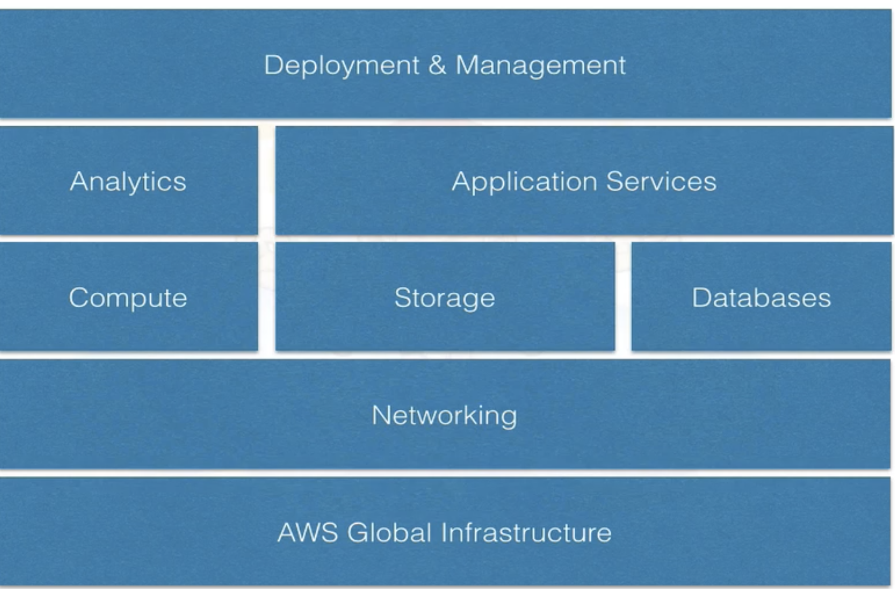

# Overview of AWS WhitePaper

## What is Cloud Computing 

**Cloud computing is the on-demand delivery of IT resources and applications via the Internet with pay-as-you-go pricing.** 

Cloud computing provides a simple way to access servers, storage, databases, and a broad set of application services over the Internet. Cloud computing providers such as AWS own and maintain the network-connected hardware required for these application services, while you provision and use what you need using a web application. 

## 6 Advantages of Cloud 

* Trade Capital Expense for variable expense

* Benefit from massive economies of scale

* Stop guessing about capacity

* Increase speed and agility 

* Stop spending money running and maintaining data centers

* Go global in minutes

## Global Infrastructure

## Security 

* State of the art electronic surveillance and multi factor access control systems.

* Staffed 24 x 7 by security guards
 
* Access is authorized on a "least privilege basis" 

## Compliance 

* SOC 1/SSAE 16/ISAE 3402 (formerly SAS 70 Type II)  
* SOC2 
* SOC3 
* FISMA, DIACAP, and Fed RAMP 
* PCI DSS Level 1 
* ISO 27001 

## Compliance 

### Several industry-specific standards 

* HIPAA Cloud Security Alliance (CSA) 
* Motion Picture Association of America (MPAA) 

## The AWS Platform

