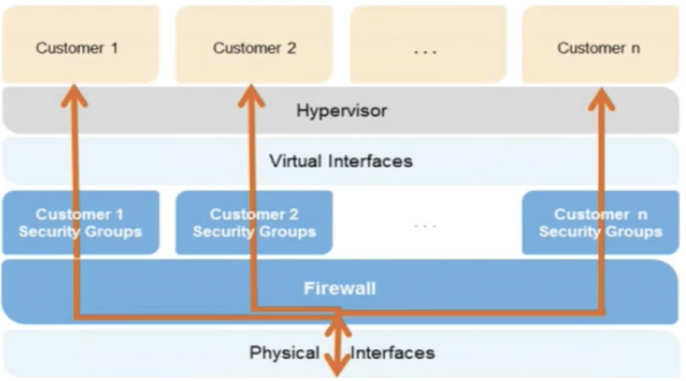

# Overview of Security Process one

## Instance Isolation

**Different instances running on the same physical machine are isolated from each other via the Xen hypervisor.** 

In addition, **the AWS firewall resides within the hypervisor layer, between the physical network interface and the instance's virtual interface.** 

All packets must pass through this layer, thus **an instance's neighbors have no more access to that instance than any other host on the Internet and can be treated as if they are on separate physical hosts.** The physical RAM is separated using similar mechanisms.  

## Other Considerations

### Guest Operating System

Virtual instances are completely controlled by you, the customer. You have full root access or administrative control over accounts, services, and applications. **AWS does not have any access rights to your instances or the guest OS.** 

### Firewall

Amazon EC2 provides a complete firewall solution; this mandatory `inbound firewall` is configured in a `default deny-all mode` and **Amazon EC2 customers must explicitly open the ports needed to allow inbound traffic.** 

### Guest Operating System

Encryption of sensitive data is generally a good security practice, and **AWS provides the ability to encrypt EBS volumes and their snapshots with `AES-256`**. The encryption occurs on the servers that host the EC2 instances, **providing encryption of data as it moves between EC2 instances and EBS storage.** 

#### In order to be able to do this efficiently and with low latency, the EBS encryption feature is only available on EC2's more powerful instance types (e.g., M3, C3, R3, G2). 

### Elastic Load Balancing

#### SSL Termination on the load balancer is supported. 

Allows you to identify the originating IP address of a client connecting to your servers, whether you're using HTTPS or TCP load balancing. 

### Direct Connect 

**Bypass Internet service providers in your network path.**  You can procure rack space within the facility housing the AWS Direct Connect location and deploy your equipment nearby. **Once deployed, you can connect this equipment to AWS Direct Connect using a cross connect.** 

Using industry standard **802.1q VLANs**, **the dedicated connection can be partitioned into multiple virtual interfaces.** This allows you to use the same connection to access public resources such as objects stored in Amazon S3 using public IP address space, and private resources such as Amazon EC2 instances running within an Amazon VPC using private IP space, while maintaining network separation between the public and private environments. 

