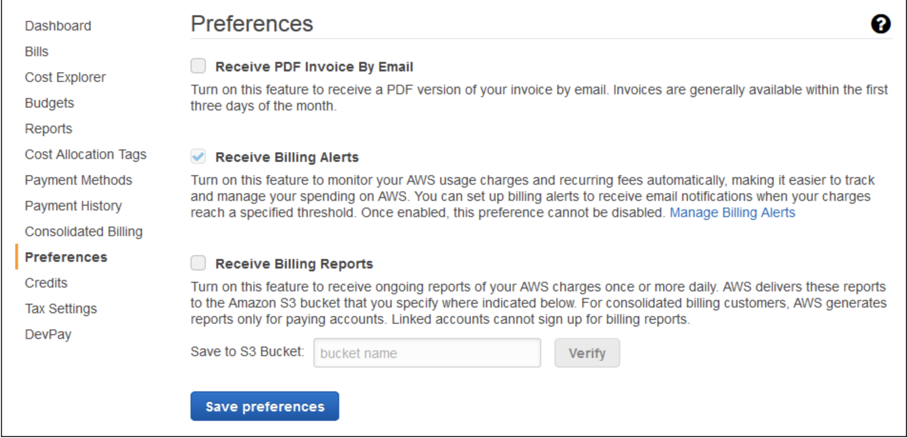
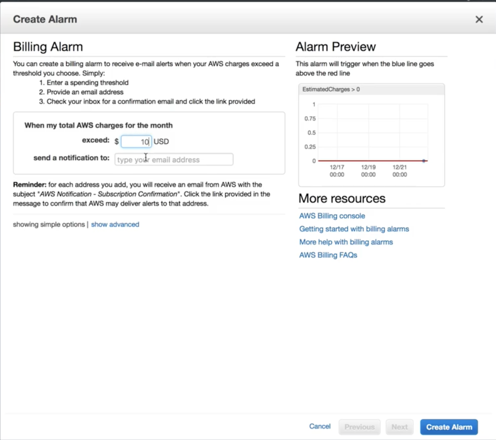
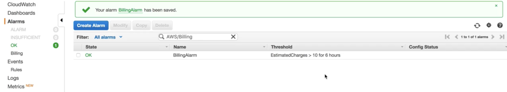

## Create a Billing Alarm to Monitor Your Estimated AWS Charges

### Reference 

[Create a Billing Alarm to Monitor Your Estimated AWS Charges](https://docs.aws.amazon.com/AmazonCloudWatch/latest/monitoring/monitor_estimated_charges_with_cloudwatch.html#turning_on_billing_metrics)

You can monitor your estimated AWS charges using Amazon CloudWatch. When you enable the monitoring of estimated charges for your AWS account, the estimated charges are calculated and sent several times daily to CloudWatch as metric data.

The alarm triggers when your account billing exceeds the threshold you specify. It triggers only when actual billing exceeds the threshold. It does not use projections based on your usage so far in the month.


## Enable Billing Alerts

### Requirements:

* You must be signed in using AWS account root user credentials; IAM users cannot enable billing alerts for your AWS account.

* For consolidated billing accounts, billing data for each linked account can be found by logging in as the paying account.

### To enable the monitoring of estimated charges

```
My account  ->  Preference -> Receive Billing Alert -> Save preferences.
```



## Create a Billing Alarm

```
CloudWatch  ->  Alarms -> Billing -> Create Alarm
```





