# Nat instances and Nat Gateway

## What we've done before

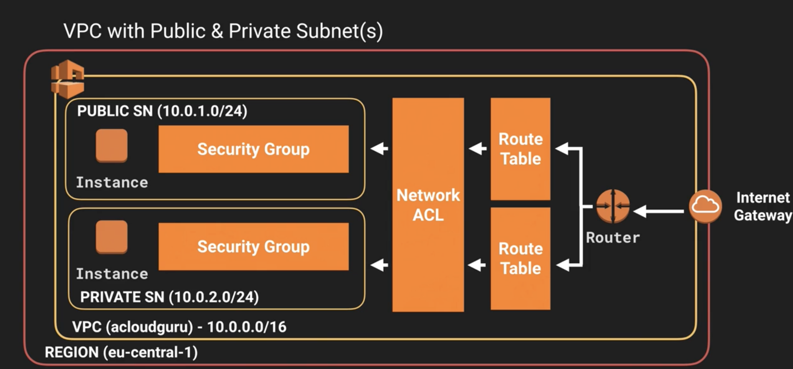

### While The instance inside the private SN cannot talk to outside net.

### Comme faire ...?

## Scenario one `NAT instance`

### 1. Select NAT instance AMI

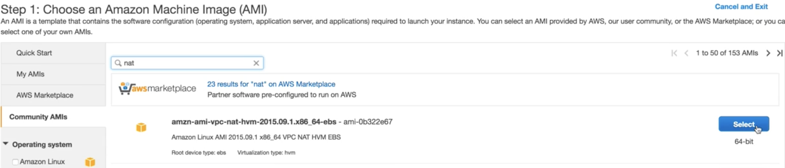

### 2. Put the NAT instance inside `Public Subnet (10.0.1.0-eu-central-1a)`

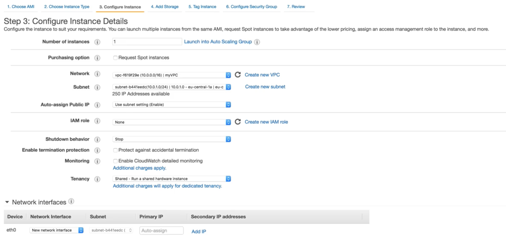

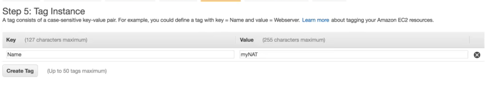

**Tag Name:** `myNAT`

**Disable `Source/Destination` on this instance**

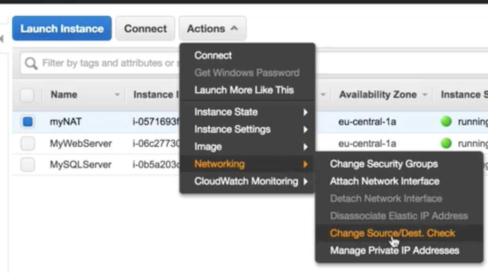

### 3. Attach the `public SN` SG `WebDMZ`to this instance

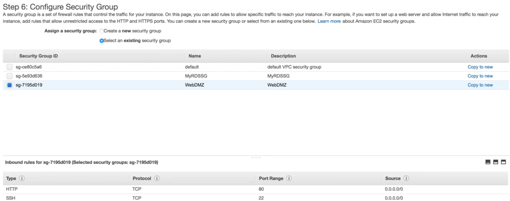

**Edit inbound rule of the SG, allow `HTTPS` inbound**

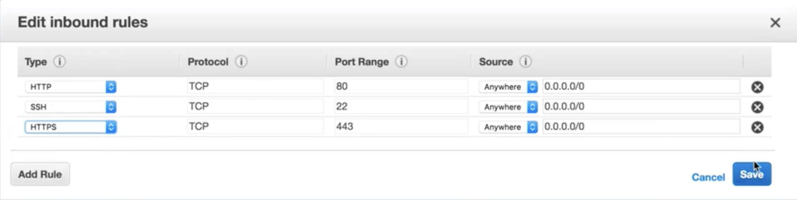

### 3. Edit `default route table (no name)` inside `myVPC`, add the `NAT instance` to the `default route table`

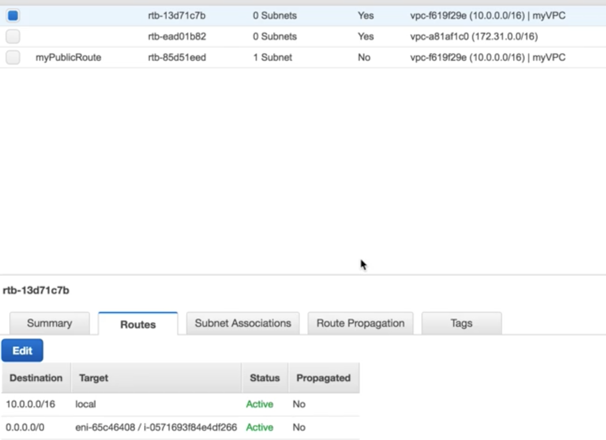

### 4.Now your private SN instance can talk to outside net

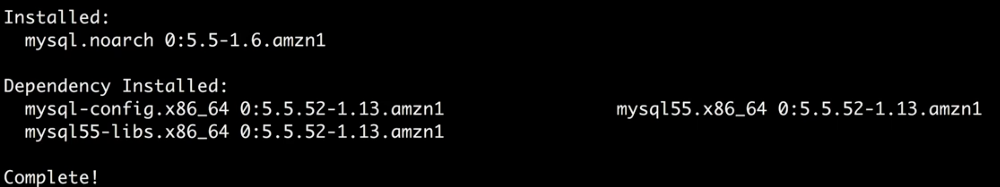

**But if you terminate this NAT instance, the `private SN instance` cannot talk to outside again**

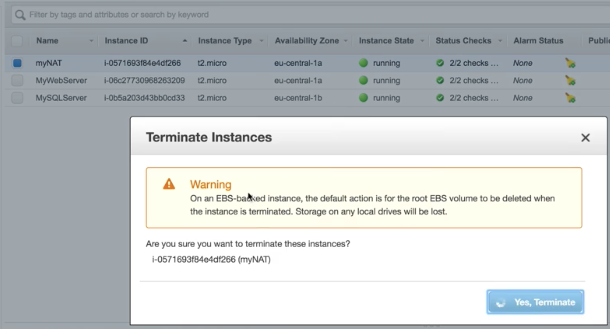

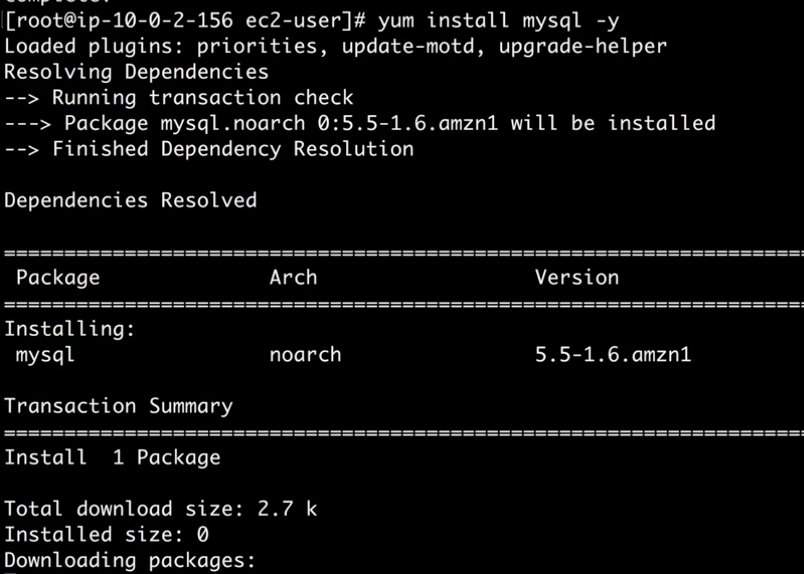

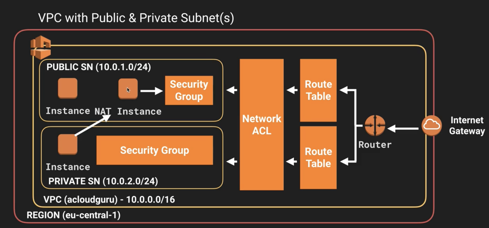

## Exam Tips - NAT instances

1. When Creating a **NAT instance**, **Disable** `Source/Destination` Check on the instance
2. NAT instance must be in a `public subnet`
3. There must be a route out of the private subnet to the NAT instance, in order for this to work
4. The amount if traffic that NAT instances supports, depends on the instance size. If you are bottlenecking, increase the instance size.
5. You can create **high availability using Autoscaling Groups**, **multiple subnets in different AZ's and a script to automate failover**
6. Behind a Security Group

## Scenario two `NAT Gateway`

### 1. Select NAT Gateway inside `public subnet`

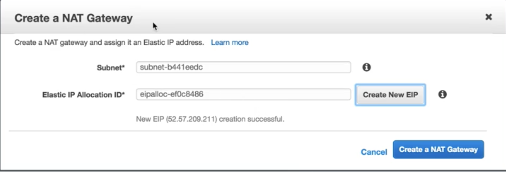

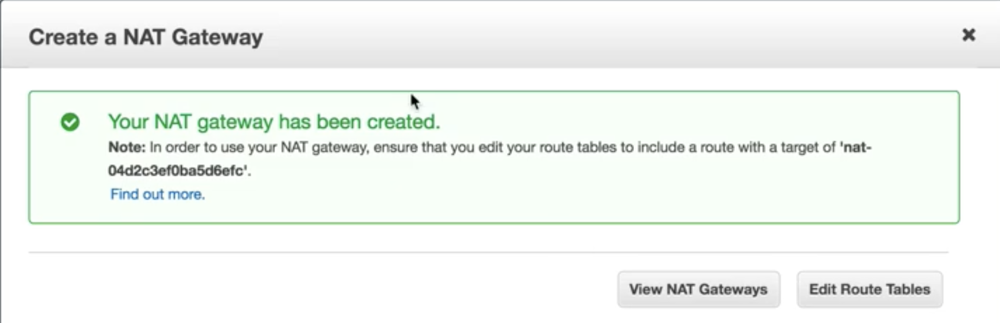

### 2. Edit `default route table (no name)` inside `myVPC`, add the `NAT Gateway` to the `default route table`

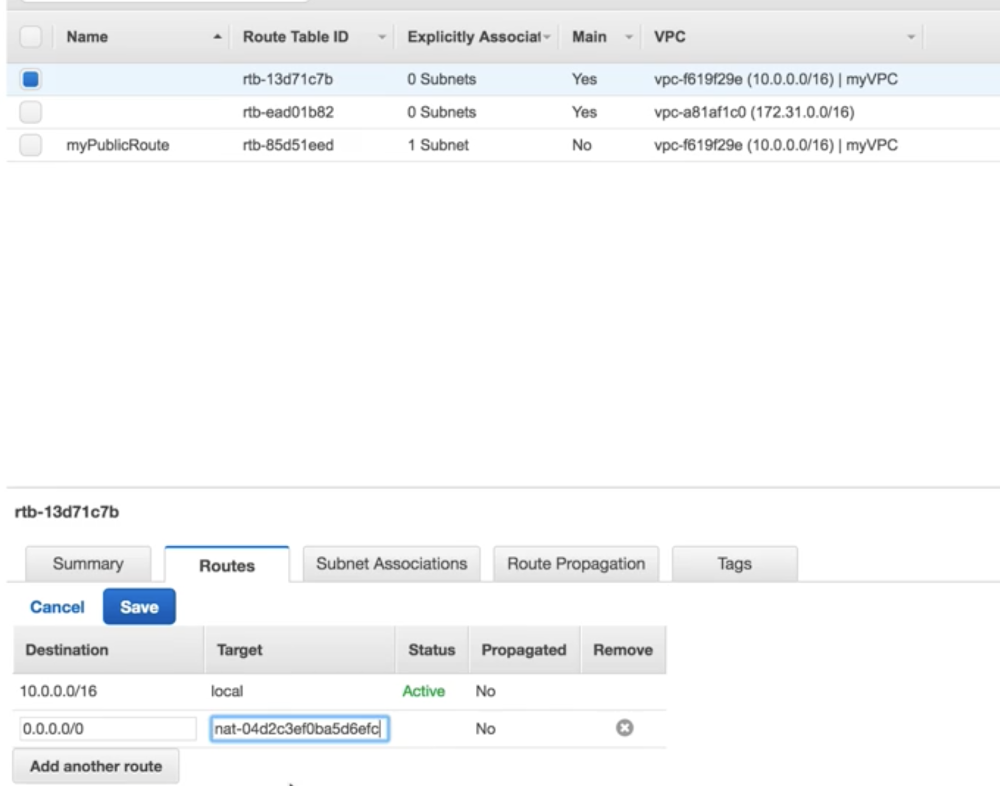

### 3. Now your private SN instance can talk to outside net

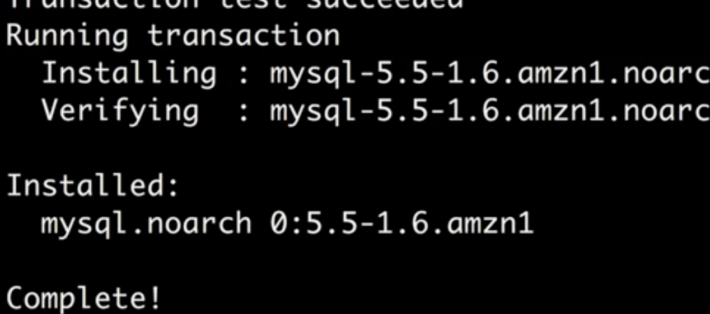

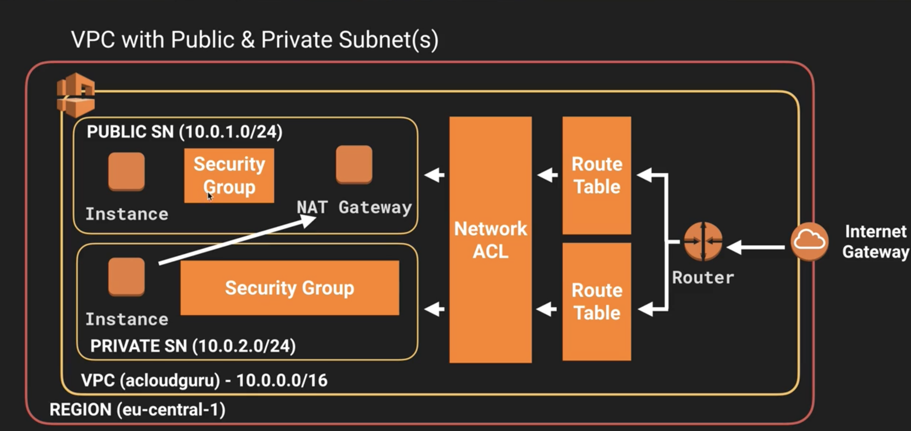

## Exam Tips - NAT Gateway

1. Preferred by enterprise
2. **Scale automatically up to 10Gbps**
3. No need to patch
4. **Not associated with security groups**
5. Automatically assigned a public groups
6. Remember to update your route tables
7. No need to disable Source/Destination Checks

## Comparison between NAT instance and Nat Gateway

[https://docs.aws.amazon.com/vpc/latest/userguide/vpc-nat-comparison.html](https://docs.aws.amazon.com/vpc/latest/userguide/vpc-nat-comparison.html)

