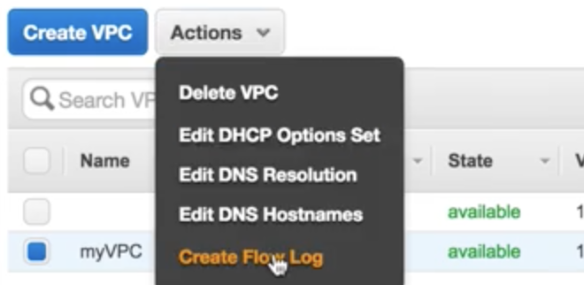
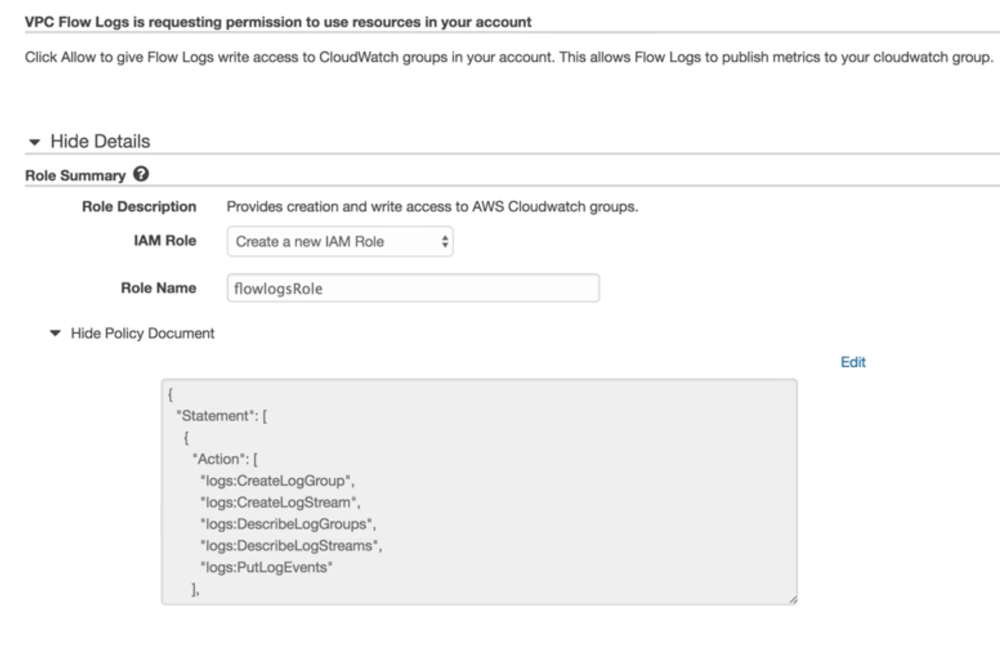
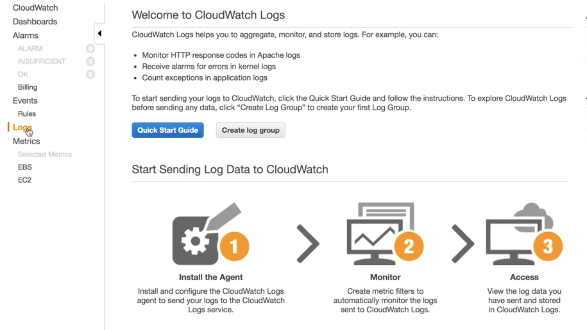
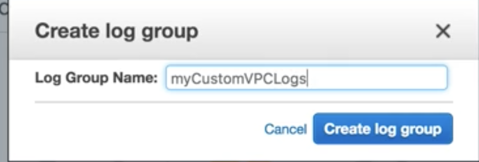
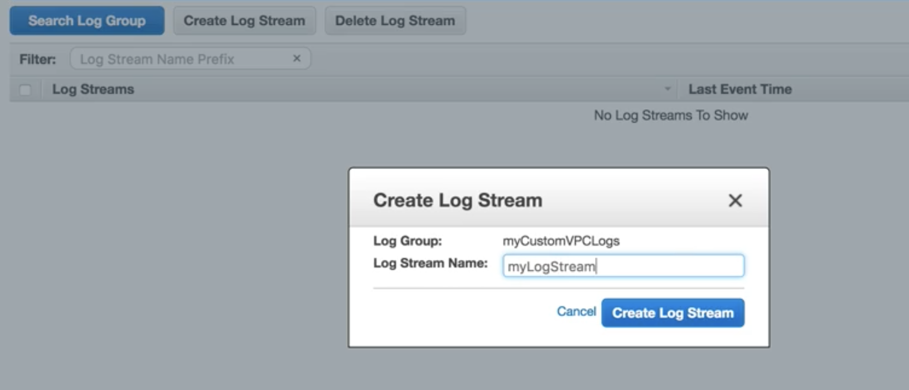
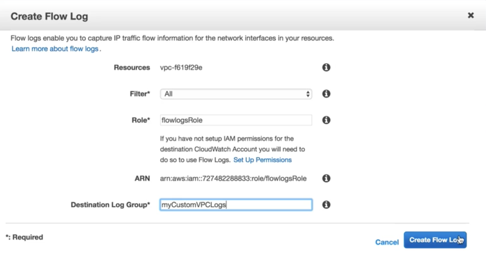
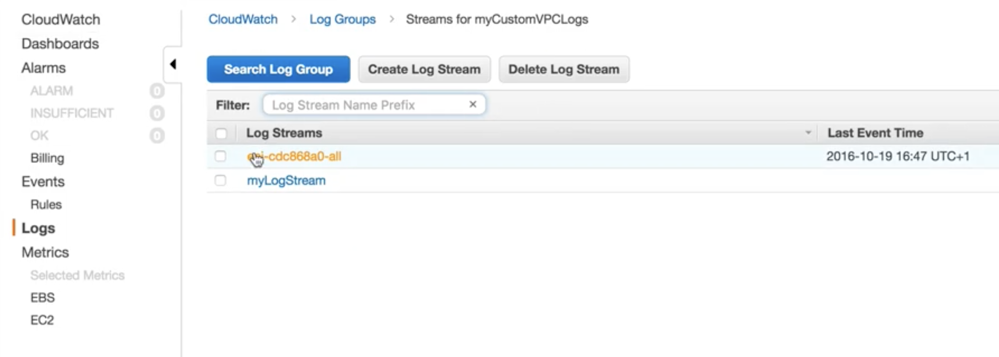
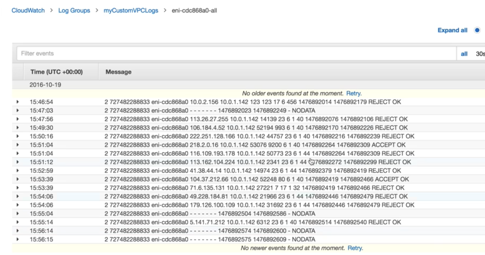

# VPC Flow Log 

## Create flow log for 'myVPC'

### Create IAM flow log role

**Name**: `flowlogsRole` with `default policy`

### Create `log group` from `CloudWatch log` 

**Name**: `myCustomVPCLogs`

### Create log stream Name `myLogStream`

### Create flow log for 'myVPC'

### Reload public IP to the instance

## Exam Tips

* You can monitor network traffic within your custom VPC's using VPC Flow Logs