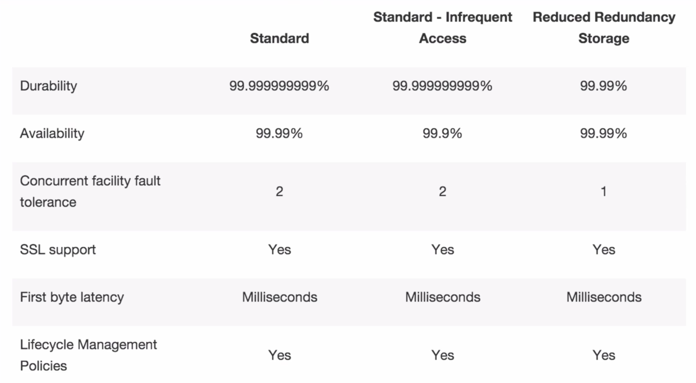

# AWS S3 Overview

## What is S3?

S3 provides developers and IT teams with **secure, durable, highly-scalable** object storage. Amazon S3 is easy to use, with a simple web services interface to **store and retrieve any amount of data from anywhere on the web**.

#### 1. S3 is a safe place to store your files
#### 2. It's Object Based Storage
#### 3. The data is spread across devices and facilities

## The basic of S3

* S3 is object based i.e. allows you to upload files
* **Files can be from 1 Byte to 5Tb**
* There is unlimited storage
* Files are stored in Buckets
* S3 is a universal namespace, that is, **names must be unique globally**
* https://s3-eu-west-1.amazonaws.com/bucketname

## S3 is Object based. Object consist of the following:

* Key (This is simply the name of the object)

* Value (This is simply the data and is made up of a sequence of bytes)

* **Version ID (Important for versioning)**

* **Metadata (Data about the data you are storing)**

* **Subresources**

* **Access Control Lists**

## S3 - The Basics

* Amazon guarantees 99.99% availability for the S3 platform
* Amazon guarantees 99.9999999% durability for S3 information
* **Tiered Storage Available**
* Lifecycle Management
* Versioning
* **Encryption**
* **Secure your data using Access Control Lists and Bucket Policies**

## S3 Storage Tiers/Classes

#### 1. S3 - `99.99% availability`, `99.9999999% durability`, stored redundantly across multiple devices in multiple facilities and is designed to sustain the loss of 2 facilities concurrently

#### 2. S3 - `IA (Infrequently Accessed) for data that is accessed less frequently`, but requires repaid access when needed. `Lower fee than S3, but you are charged a retrieval fee`.

#### 3. `Reduced Redundancy Storage` - Designed to provide 99.99% durability and 99.99% availability of objects over a given year

#### 4. Glacier - `Very Cheap, but used for archival only`. It takes `3-5 hours` to restore from Glacier

## Glacier

Amazon Glacier is an extremely low-cost storage service for **data archival**. Amazon Glacier stores data for as little as **$0.01 per gigabytes per month**, and is optimized for data that is infrequently access and for which **retrieval times of 3 to 5 hours** are suitable.

## S3 - Charges

### charged for;

* Stroage
* Requests
* Data Transfer Pricing

## S3 - Exam Tips For s3

* Remember S3 is object based i.e. allows you to upload files
* Files can be from 1 Byte to 5Tb
* There is unlimited storage
* Files are stored in Buckets
* S3 is a universal namespace, that is, **names must be unique globally**
* https://s3-eu-west-1.amazonaws.com/bucketname

## S3 - Exam Tips For s3

#### 1.Read after Write consistency for PUTS of new Object(can take some time to propagate)
#### 2.Eventual Consistency for overwrite PUTS and DELETES

### Which means:

1. `Add` new object is an instance operation
2. `Update` and `Delete` may take some times, not immediately

## Exam Tips for s3 storage Classes/Tiers

1. **S3** (durable, immediately available, **frequently accessed**)
2. **S3 - IA** (durable, immediately available, **infrequently accessed**)
3. **S3 - RRS** Reduced Redundancy Storage (data that is easily reproducible, such as thumb nails)
4. **Glacier** - **Archived data, where you can wait 3-5 hours before accessing**.

## Remember the core fundamentals of S3

* Key (name)
* Value (data)
* Version ID
* Metadata
* Access control lists

### Object based storage only (for files).
### _Not suitable to install an operating system on._
