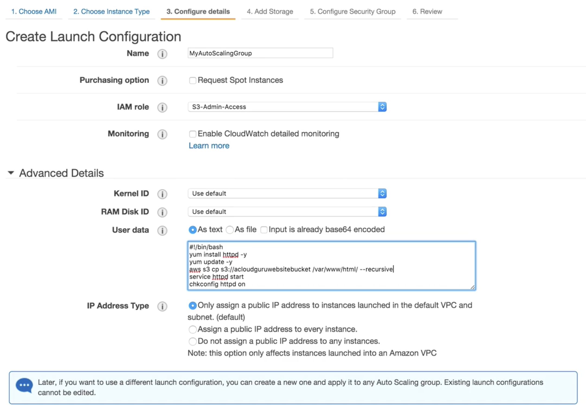
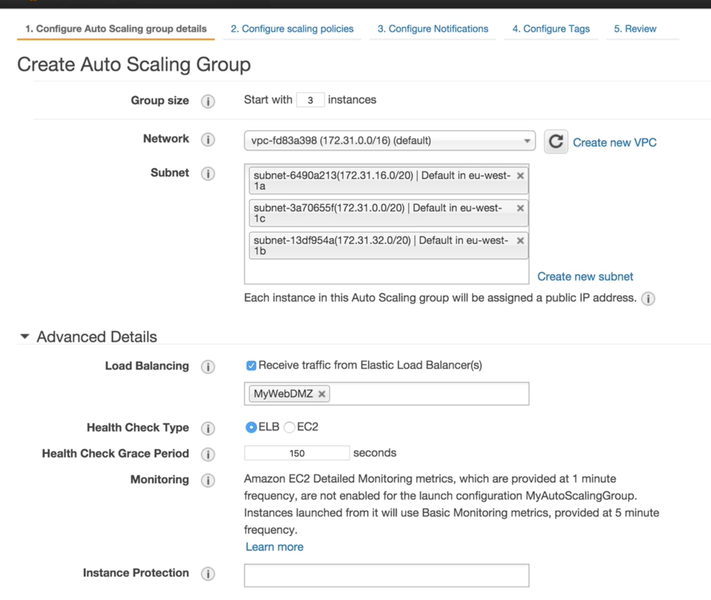
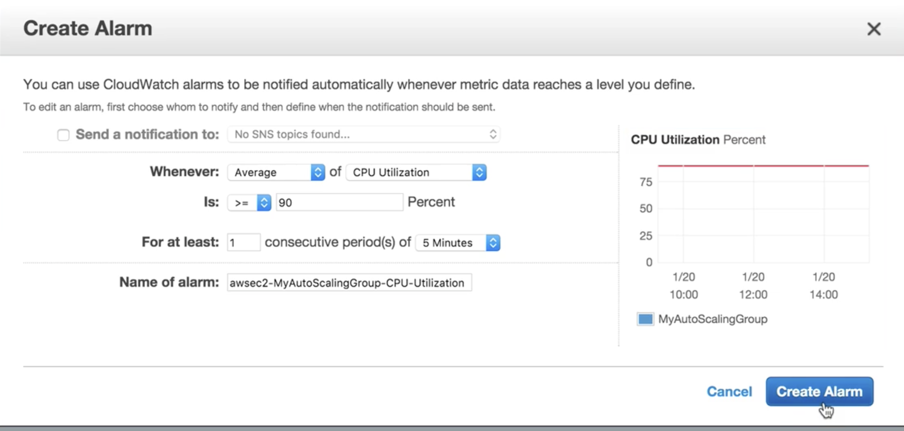
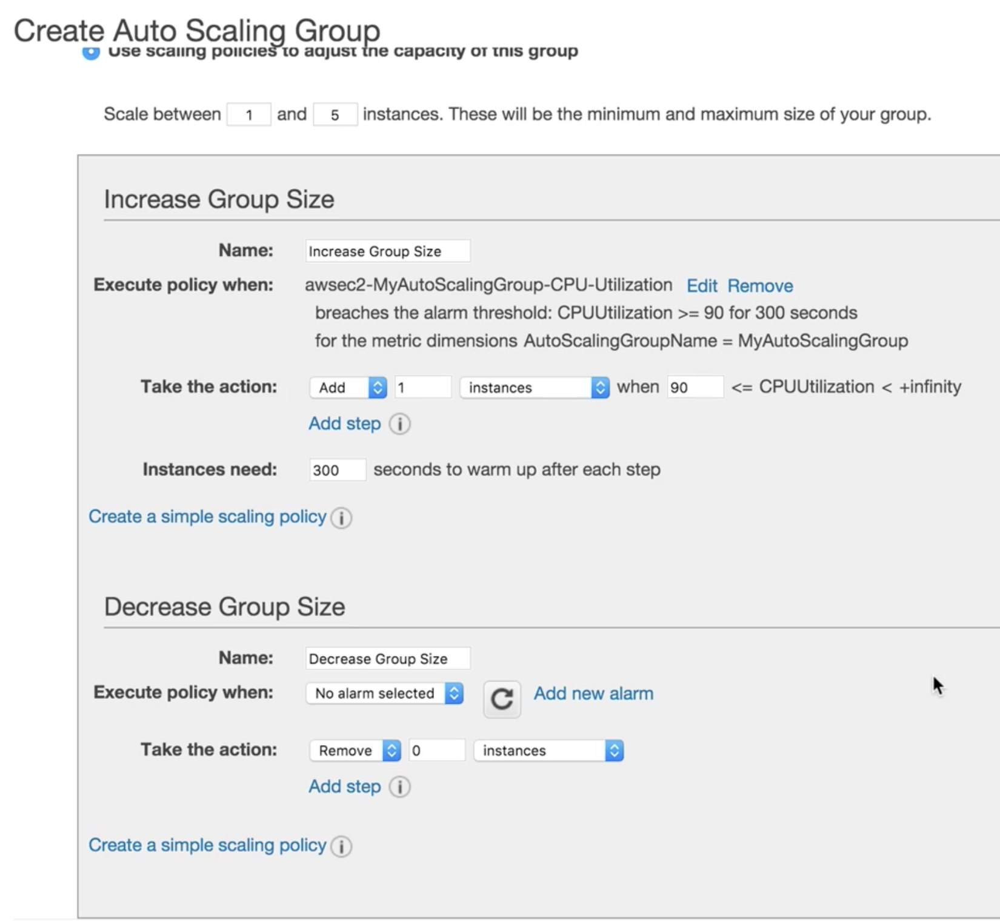
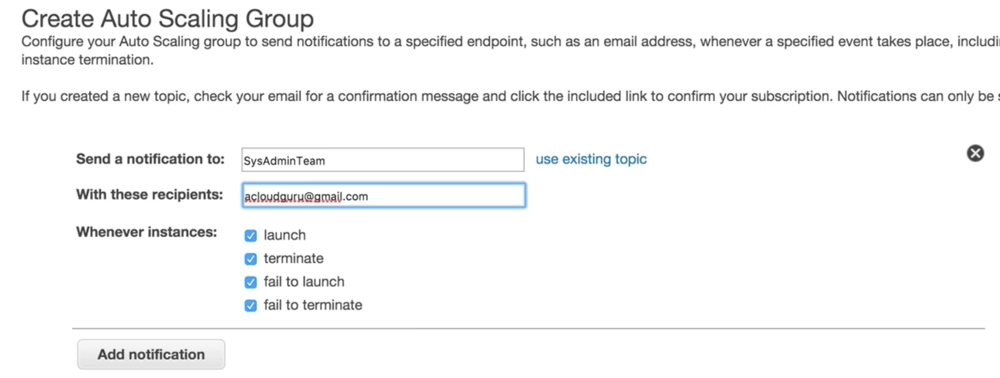

# Launch Configurations & Auto Scaling Groups

## Create Launch Configurations Firstly

## Create AutoScaling Group based on Launch Configurations

* ASG WILL automatically spreads these three instances to three subnets
* Health check grace period: **150s**  150s is set as a session for instances are totally launched and all packages installed. (Apache installed in this exp.)

### create alarm for ASG

### create alarm for ASG policies to adjust the capacity of this group

### send notification for ASG

