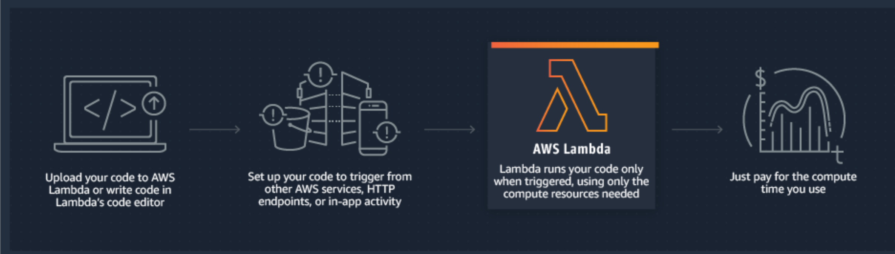

# Lambda

## Introduction

**AWS Lambda lets you run code without provisioning or managing servers.** 

With Lambda, you can run code for virtually any type of application or backend service - all with zero administration. Just upload your code and Lambda takes care of everything required to run and scale your code with high availability. 

## What actually is it?

* Data Centres

* Hardware

* Assembly Code/Protocols

* High Level Languages

* Operating Systems

* AWS API's

* AWS Lambda


Lambda runs your code on high-availability compute infrastructure and **performs all the administration of the compute resources**, including `server` and `operating system maintenance`, `capacity provisioning` and `automatic scaling`, code and security patch deployment, and code monitoring and logging.

### All you need to do is supply the code


## How it works




## What events trigger Lambda

You can use AWS Lambda to respond to 

* `table updates in Amazon DynamoDB`, 
 
* `modifications to objects in Amazon S3 buckets`, 

* `messages arriving in an Amazon Kinesis Stream`, 

* `AWS API call logs created by AWS cloudTrail`, 

* `custom events from mobile applications`, 

* `web applications`, 

* `other web services`


## Lambda

### Supported Programming Languages - Javascript

### AWS Lambda is designed to provide 99.99% availability for both the service itself and for the functions it operates


## Lambda Pricing

### Request:

* First 1 million requests are free
* $0.20 per 1 million requests there after

### Duration

**Duration is calculated from the time you code begins executing until it returns or otherwise terminates, rounded up to the nearest 100ms**. 

**The price depends on the amount of memory you allocate to your function.** you are charged `$0.00001667` for every GB-second used.


### Free tier

The Lambda free tier includes 1M free requests per month and 400,000 GB-seconds of compute time per month. The memory size you choose for your Lambda functions determines how long they can run in the free tier. The Lambda free tier does not automatically expire at the end of your 12 month AWS Free Tier term, but is available to both existing and new AWS customers indefinitely.


## Example 1

If you allocated 512MB of memory to your function, executed it 3 million times in one month, and it ran for 1 second each time, your charges would be calculated as follows:

#### Monthly compute charges:


```
The monthly compute price is $0.00001667 per GB-s and the free tier provides 400,000 GB-s.

Total compute (seconds) = 3M * (1s) = 3,000,000 seconds

Total compute (GB-s) = 3,000,000 * 512MB/1024 = 1,500,000 GB-s

Total compute – Free tier compute = Monthly billable compute GB- s

1,500,000 GB-s – 400,000 free tier GB-s = 1,100,000 GB-s

Monthly compute charges = 1,100,000 * $0.00001667 = $18.34
```
