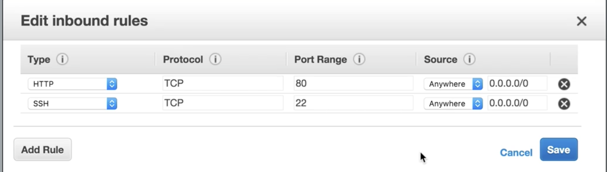
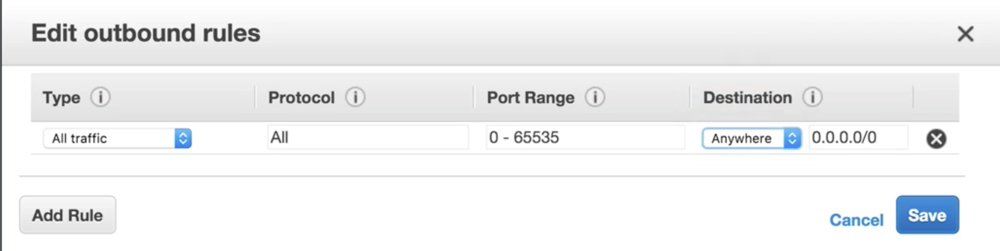

# EC2 Security Group Setup

## 1. SG rule changes will be enabled immediately



### Inbound rules are all denied by default unless you change it and add new rules on it 
### However, you can only allow rules rather than deny rules


**For example, if you delete `HTTP` inbound rule, after you start `HTTPd` on the server, this machine cannot be access from outside**

```
$ sudo su
$ service httpd status
httpd is stopped

$ service httpd start
starting httpd:                            [ OK ]

$ chconfig httpd on                        # automatically start httpd
```

## 2.SG rule is stateful 

### You add inbound rules on `special ports` and these rules will `automatically` allow outbound rule on those port

### You don't have to specify those ports with rules in outbound table


## Use Default outbound rules normally




## Exam Tips:

1. All inbound Traffic is Blocked
2. All Outbound Traffic is Allowed
3. Changed to Security Groups take effect immediately
4. You can have any number of EC2 instances with a security group
5. Security Groups are **STATEFUL**

### If you create an inbound rule allowing traffic in, that traffic is automatically allowed back out again


