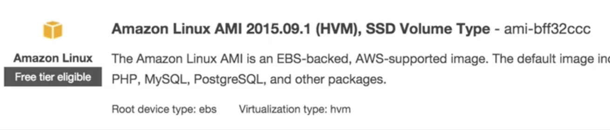
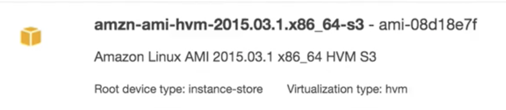
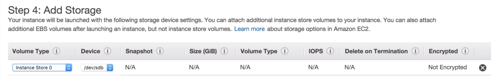
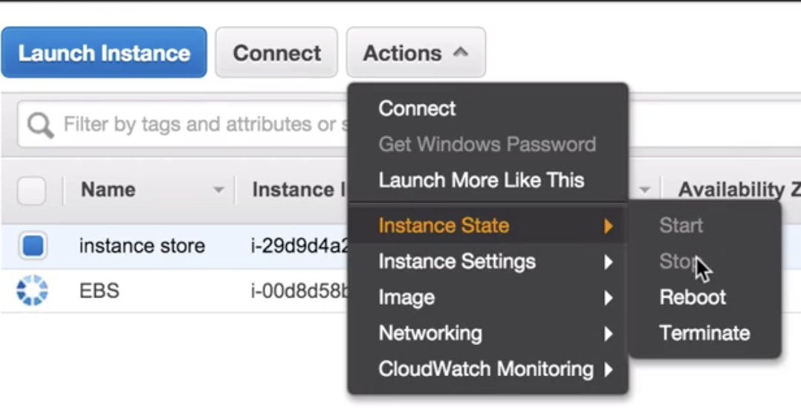

# AMI Types (EBS vs Instance Store)

## You can select your AMI based on;

#### 1.Region (see Regions and Availability Zones)
#### 2.Operating Sytem
#### 3.Architecture system (32-bit or 64-bit)
#### 4.Launch Permissions
#### 5.Storage for the Root Device (Root Device Volume)
* Instance Store (EPHEMERAL STORAGE)
* EBS Backed Volumes

### Root Device Types

#### EBS Backed Volumes:

#### Instance-Store Volumes:

### start Instance-Store based instance

#### Add Storage

Your instance will be launched with following storage device settings. 

* You can attach additional instance store volumes to your instance. 
* You can also attach additional EBS volumes after launching an instance, but not instance volumes

### You can `stop EBS instance`, but you cannot `stop instance-store instance`, but only `reboot` and `terminate` the instance-stored instance

### You can detach EBS volume from instance, but you cannot detach instance-stored volume (you cannot even see it) from instance 

## EBS vs Instance Store

1. All AMIs are categorized as either backed by `Amazon EBS` or backed by `instance store`
2. **For EBS Volumes**: The `root device` for an instance launched from the AMI is `Amazon EBS volume` created from an `Amazon EBS snapshot`
3. **For instance Store Volumes**: The root device for an instance launched from AMI is an instance store volume created from a `template stored in Amazon S3`

## Exam Tips

* Instance Store Volumes are sometimes called Ephemeral Storage
* **Instance store volumes cannot be stopped. If the underlying host fails, you will lose your data**
* **EBS backed instances can be stopped. You will not lose the data on this instance if it is stopped**
* You can reboot both, you will not lose your data
* By default, both **ROOT volumes** will be `deleted on termination`. **However with EBS volumes, you can tell AWS to keep the root device volume.**

