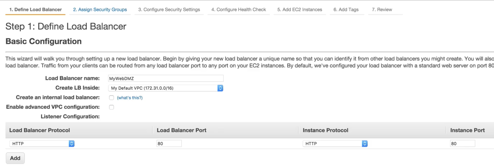
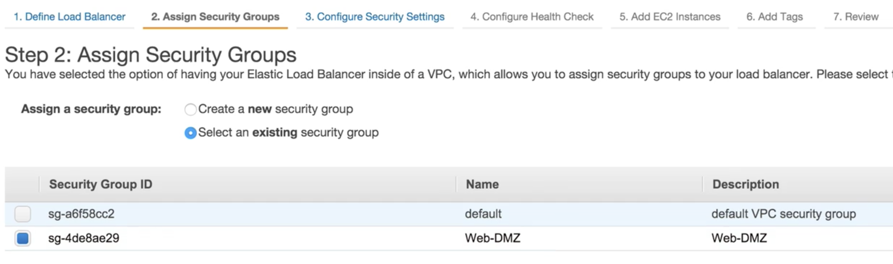
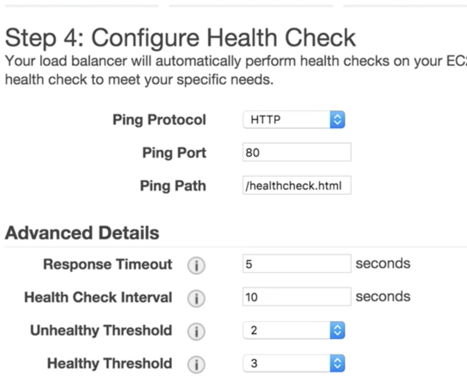
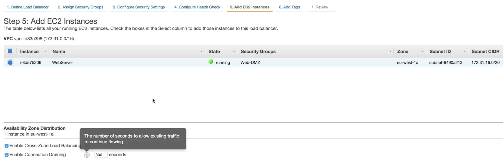
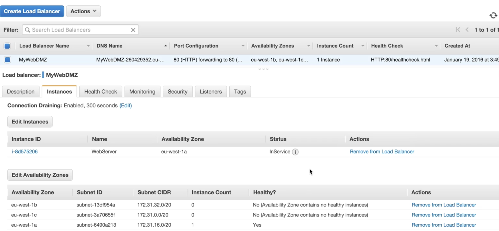
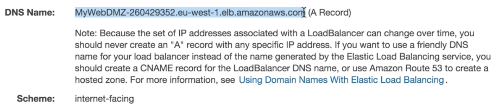

# Elastic Load Balancer - LAB

## Define Load Balancer

### Create `internal load balancer` whether it's internet facing or not

## Assign Security Group

## Configure Health check

### Unhealthy Threshold:

**The number of consecutive failed health checks that must occur before declaring an EC2 instance unhealthy.**

### Healthy Threshold

**The number of consecutive successful health checks that must occur before declaring an EC2 instance healthy.**

If the health checks exceed **UnhealthyThresholdCount** consecutive **failures**, the load balancer takes the instance out of service. When the health checks exceed **HealthyThresholdCount** consecutive **successes**, the load balancer puts the instance back in service.

## Add Instance to ELB

#### Enable Connection Draining 

In AWS, when you enable `Connection Draining` on a load balancer, **any back-end instances that you deregister will complete requests** that are in progress before deregistration

## Instance `In Service` 

## ELB only has DNS, No ip address

## Exam Tips

#### In service or Out of Service
#### Health Check
#### Have their own DNS name. You are never given an IP address

