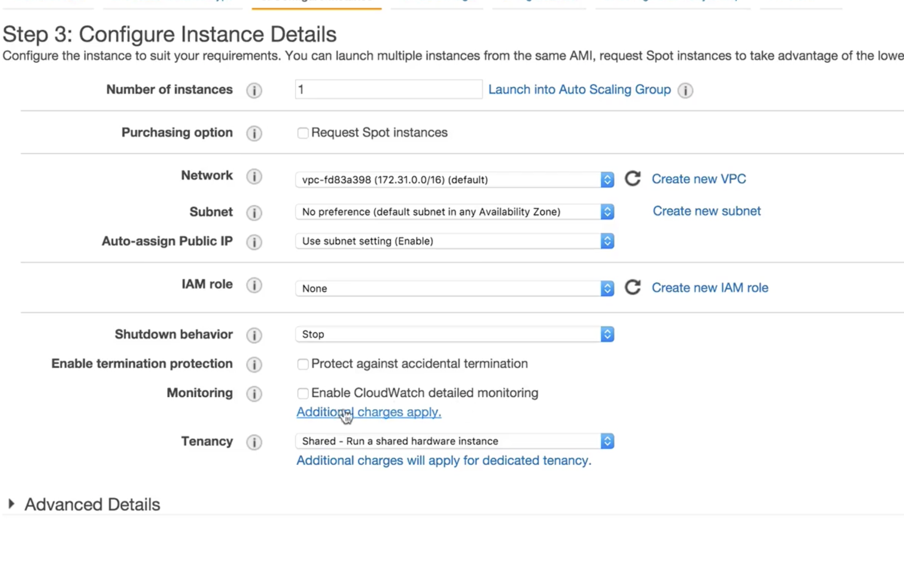
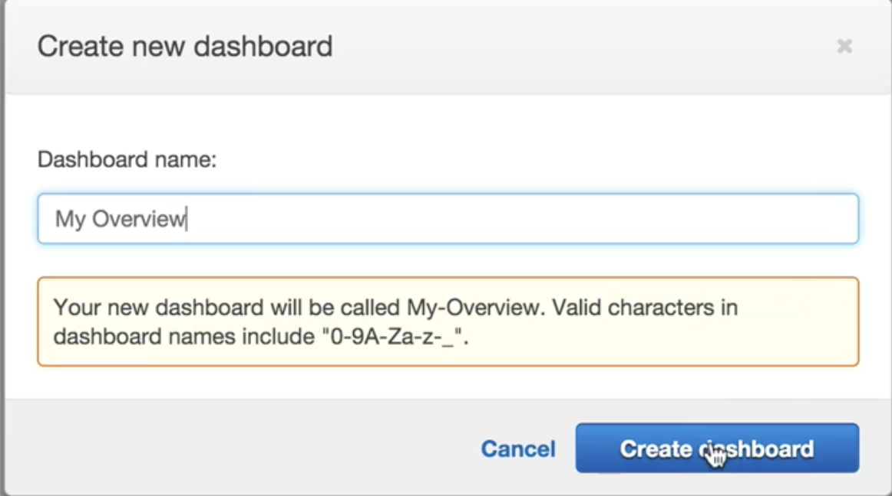
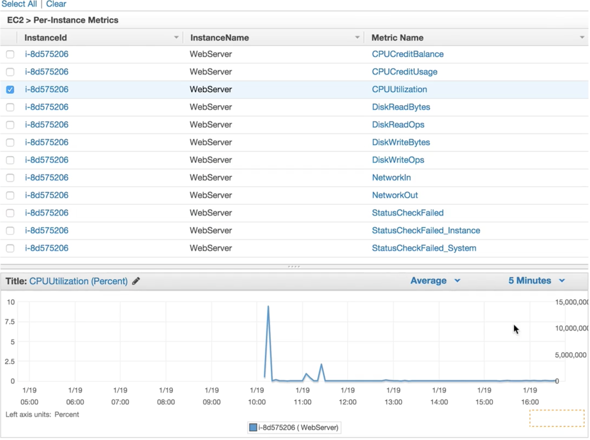
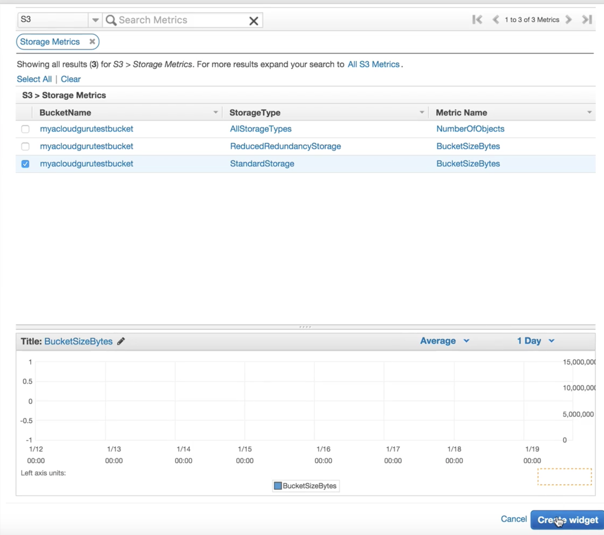
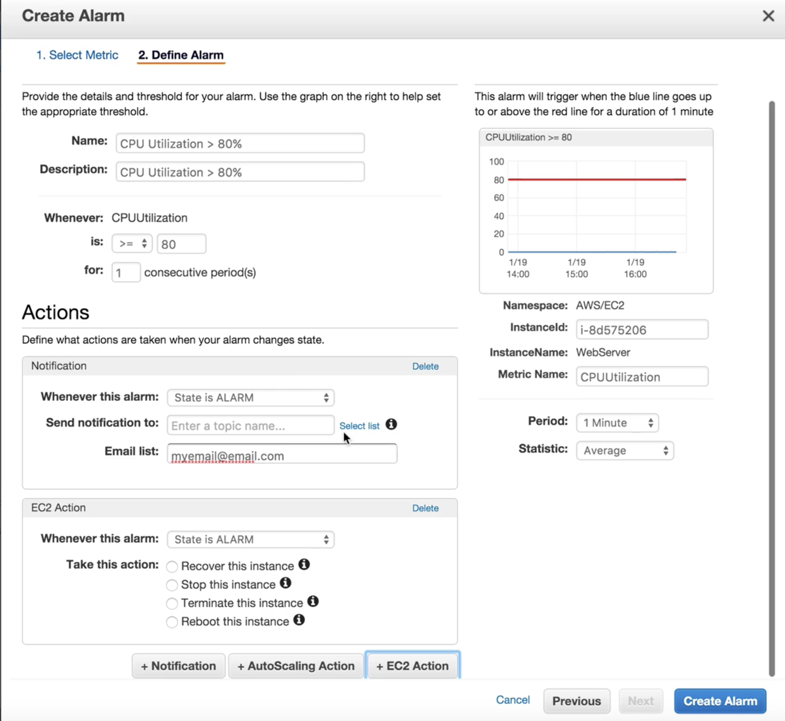

# CloudWatch Lab

### When you creating EC2 instance, you can `enable CloudWatch detailed monitoring`

## Create Dashboard for CloudWatch add metrics for instance

## Create metrics for S3 bucket

## Create alarm for EC2 

* Metrics
* Actions
  * Notification
  * EC2 Action

## Exam Tips

### Standard Monitoring = 5 minutes
### Detailed Monitoring = 1 Minute
### cloudtrail is auditing tool and cloudwatch is for performance monitoring tool

## What Can I do with CloudWatch

* **Dashboards** - Creates awesome dashboards to see what is happening with your AWS environment
* **Alarms** - Allows you to set Alarms that notify you when particular thresholds are hit
* **Events** - **CloudWatch Events** helps you to **respond to state changes** in you AWS resources 
* **Logs** - **CloudWatch Logs** helps you to **aggregate, monitor, and store logs.**

