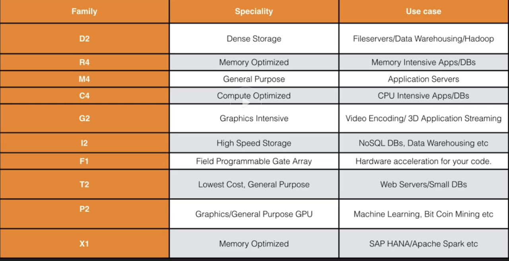
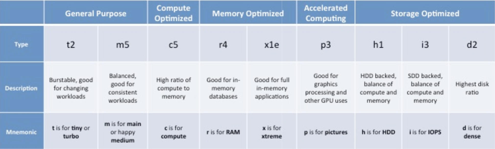

# AWS EC2

## Courses List

1. [AWS EC2 Overview](1ec2_overview.md)
2. [Launch our first EC2 instance](2ec2_launch_lab.md)
3. [EC2 Security Group Setup](3ec2_sg_lab.md)
4. [AMI Types (EBS vs Instance Store)](4ec2_AMI_types.md)
5. [Volume vs Snapshot Lab](5ec2_vol_snapshot.md)
6. [Raid, Volume and Snapshots](6ec2_windows_RAID.md)
7. [Elastic Load Balancer - LAB](7ec2_elb_lab.md)
8. [CloudWatch Lab](8ec2_cloudwatch_lab.md)
9. [AWS Command Line Lab](9ec2_Cli_lab.md)
10. [Identity Access Management Roles Lab](10ec2_IAM.md)
11. [Bash Scripting Lab](11ec2_bash_lab.md)
12. [Instance Metdata Data](12ec2_metadata.md)
13. [Launch Configurations & Auto Scaling Groups](13ec2_lc_asg.md)
14. [EFS](14ec2_EFS_lab.md)
15. [How to Use Putty & PuttyKeyGen](15ec2_putty_puttykeygen.md)
16. [Lambda](16ec2_lambda.md)

## Exam Tips for EC2

### Know the differences between;

* On Demand
* Spot
* Reserved (Reserved is most cheapest way)

### Remember with spot instances;

* if you terminate the instance, you pay for the hour
* If AWS terminate the spot instance, you get the hour it was terminated in for free.

### EBS consists of:

### Solid-State Drives (SSD)

* General Purpose SSD (gp2)
* Provisioned IOPS SSD (io1)

### Hard disk Drives (HDD)

* Throughput Optimized HDD (st1)
* Cold HDD (sc1)
* EBS Magnetic. (cheap, infrequently accessed storage)

### You cannot mount 1 EBS volume to multiple EC2 instances, instead use EFS

## EC2 Lab Exam Tips

1. Termination Protection is turned off by default, you **must** turn it on
2. On an EBS-backed instance, the default action is for the root EBS volume to be deleted when instance is terminated
3. **Root Volumes cannot be encrypted by default, you need a third party tool (such as bit locker etc) to encrypt the root volume**
4. **Additional volumes can be encrypted.**

## EC2 SG Lab Exam Tips

* All inbound Traffic is Blocked
* All Outbound Traffic is Allowed
* Changed to Security Groups take effect immediately
* You can have any number of EC2 instances with a security group
* Security Groups are STATEFUL

### If you create an inbound rule allowing traffic in, that traffic is automatically allowed back out again

## Volumes VS Snapshots

* Volumes exist on EBS: `Virtual Hard Disk`
* Snapshot exits on S3
* You can take a snapshot of a volume, this will `store that volume on S3`
* Snapshots are point in time copies of Volumes
* Snapshots are `incremental`, this means that only the blocks that have changed since your `last snapshot are move to S3`
* If this is your first snapshot, it may take some time to create

## Volumes VS Snapshots - Security

* **Snapshots of encrypted volumes are encrypted automatically**
* Volumes restored from encrypted snapshots are encrypted automatically
* You can share snapshots, but only if they are unencrypted

#### These snapshots can be shared with other AWS account or made public

## EBS vs Instance Store - Exam Tips

* Instance Store Volumes are sometimes called Ephemeral Storage
* **Instance store volumes cannot be stopped. If the underlying host fails, you will lose your data**
* **EBS backed instances can be stopped. You will not lose the data on this instance if it is stopped**
* You can reboot both, you will not lose your data
* By default, both **ROOT volumes** will be `deleted on termination`. **However with EBS volumes, you can tell AWS to keep the root device volume.**

## How can I take a Snapshot of a RAID Array?

**Problem** - Take a snapshot, the snapshot `excludes data held in the cache` by applications and the OS. 

This tends not to matter on a single volume, however using multiple volumes in a RAID array, this can be a problem due to interdependencies of the array. 

###  Solution - Take an application consistent snapshot. 

## How can I take a Snapshot of a RAID Array? 

* Stop the application from writing to disk. 
* Flush all caches to the disk. 

### How can we do this? 

* Freeze the file system 
* Unmount the RAID Array 
* Shutting down the associated EC2 instance. 

## Amazon Machine Images - Exam Tip

### AMI's are regional. 

**You can only launch an AMI from the region in which it is stored.**

**However you can copy AMI's to other regions using the console**, command line or the Amazon EC2 API

## Elastic Load Balancer - Exam Tips

#### In service or Out of Service
#### Health Check
#### Have their own DNS name. You are never given an IP address

## CloudWatch Lab - Exam Tips

* Standard Monitoring = 5 minutes

* Detailed Monitoring = 1 Minute

* CloudTrail is auditing tool and CloudWatch is for performance monitoring tool

## What Can I do with CloudWatch

* **Dashboards** - Creates awesome dashboards to see what is happening with your AWS environment
* **Alarms** - Allows you to set Alarms that notify you when particular thresholds are hit
* **Events** - **CloudWatch Events** helps you to **respond to state changes** in you AWS resources 
* **Logs** - **CloudWatch Logs** helps you to **aggregate, monitor, and store logs.**

## AWS Command Line Lab - Exam Tips

#### 1. You can only assign an IAM role to an instance when you creating a new ec2 instance. You cannot assign latter, after you already created it
#### 2. For protection: use role rather than credentials, access keys

## Identity Access Management Roles Lab - Exam Tips

* **Roles are more secure than storing your access key and secret access key on individual EC2 instances**
* **Roles are easier to manage**
* **Roles can only be assigned when that EC2 instance is begin provisioned** 
* **Roles are universal, you can use them in any region**
* **You can can change policy to roles anytime, and it will affect immediately**

## Instance Metadata Data - Exam Tips

* Used to get information about an instance (such as public ip)
* curl _http://169.254.169.254/latest/meta-data/_
* **No such things as use-data for an instance**

## EFS - Exam Tips

* Supports the network file system version 4 (NFSv4) protocol
* You only pay for the storage you use ( no pre-provisioning required)
* Can scale up to the petabytes
* **Can support thousands concurrent NFS connections**
* **Data is stored multiple AZ's within a region**
* Read after write consistency
* Code all in one file system, all in one container, then mount to multiple instance

## What Is Lambda? 

AWS Lambda is a compute service where you can **upload your code and create a Lambda function**. **AWS Lambda takes care of provisioning and managing the servers** that you use to run the code. You don't have to worry about **operating systems, patching, scaling**, etc. You can use Lambda in the following ways. 

* As an **event-driven** compute service where AWS Lambda runs your code in response to events. **These events could be change to data in an Amazon S3 bucket or an Amazon DynamoDB table**
 
* **As a compute service to run your code in response to HTTP requests using Amazon API Gateway or API calls made using AWS SDKs**.

