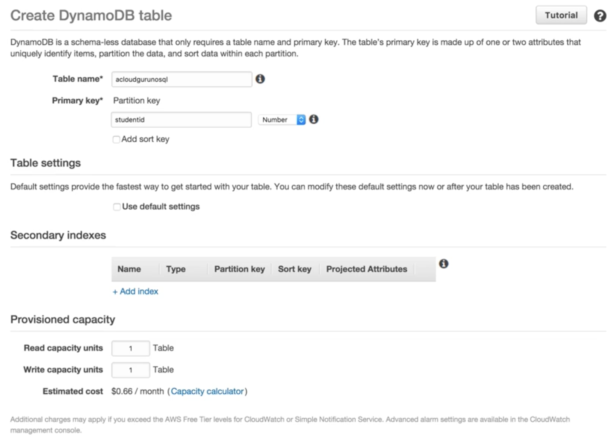
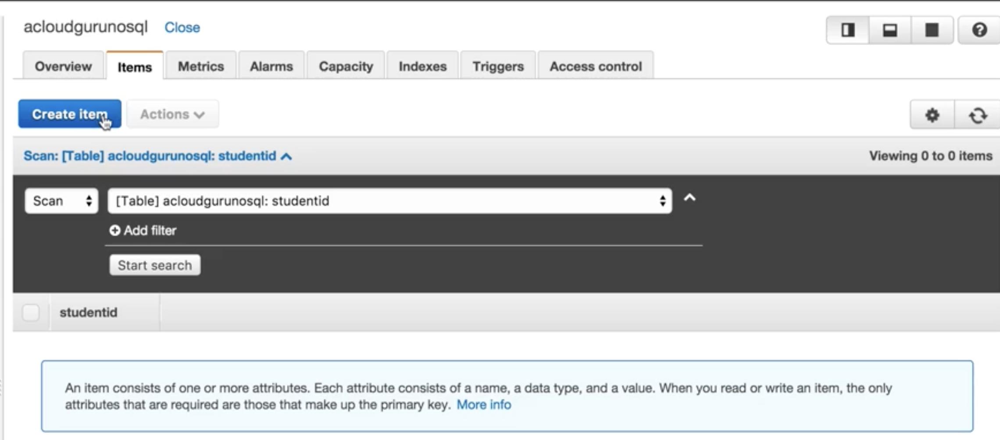
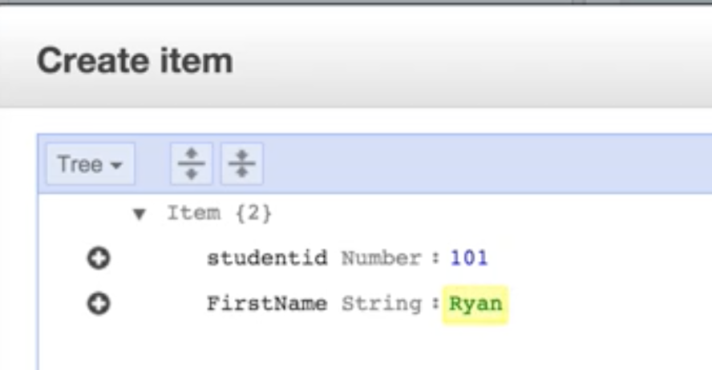
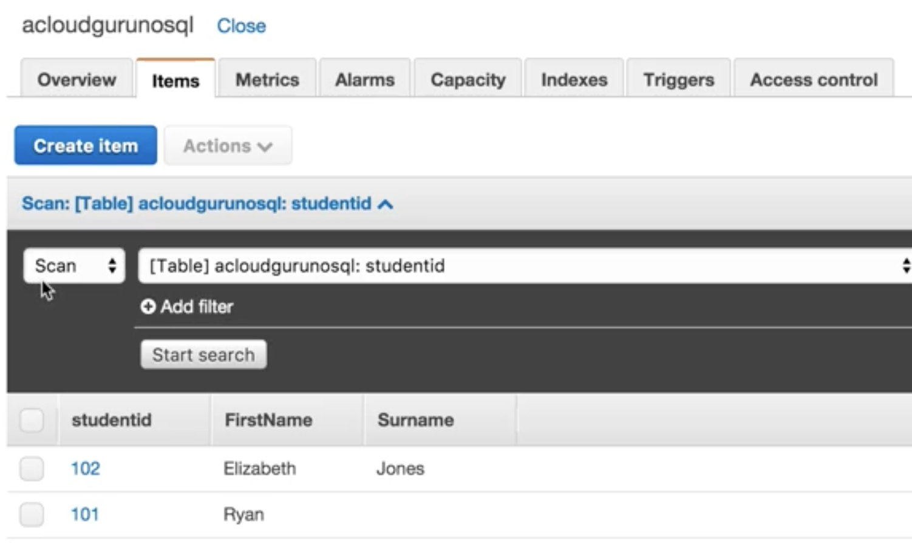
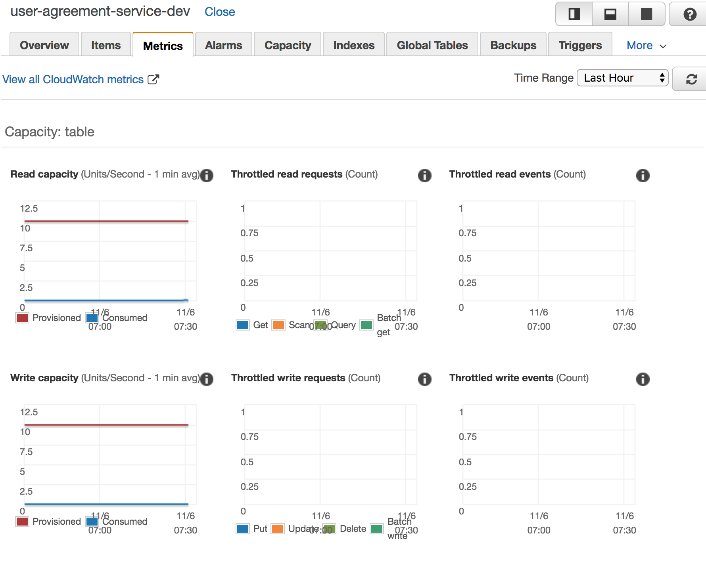
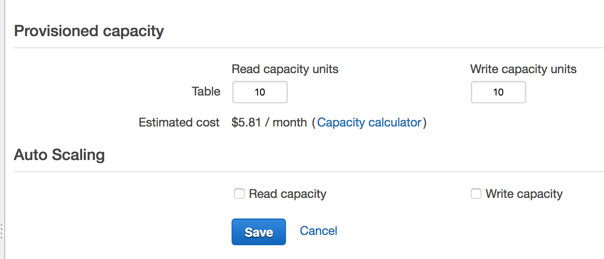

# DynamoDB

## What is DynamoDB? 

`Amazon DynamoDB` is a **fast and flexible NoSQL database service** for all applications that need consistent, single-digit millisecond latency at any scale. It is a fully managed database and supports both **document** and **key-value data models**. 

**Its flexible data model and reliable performance** make it a great fit for mobile, web, gaming, ad-tech, loT, and many other applications. 


## DynamoDB 

* Stored on SSD storage 
* Spread Across 3 geographically distinct data centers 
* **Eventual Consistent ReadS** (Default) 
* **Strongly Consistent Reads** 

### Eventual Consistent Reads

**Consistency across all copies of data is usually reached within a second**. Repeating a read after a short time should return the updated data. (Best Read Performance) 

### Strongly Consistent Reads

**strongly consistent read returns a result that reflects all writes that received a successful response prior to the read**. 

* Immediately read result after write db, you can use SCR
* If you can wait for couple seconds, you can use ECR

## DynamoDB Pricing

### * Provisioned Throughput Capacity

* Write Throughput `$0.0065` per hour for every `10 units` 
* Read Throughput `$0.0065` per hour for every `50 units`

### * Storage costs of `$0.25Gb` per month. 


## Pricing Example 

Let's assume that your application needs to perform **1 million writes** and **1 million reads** per day, while **storing 3 GB of data**. 

#### First, you need to calculate how many writes and reads per second you need. 


1 million evenly spread writes per day is equivalent to 

```
1,000,000 (writes) / 24 (hours) / 60 (minutes) / 60 (seconds) = 11.6 writes per second.
```

#### A DynamoDB Write Capacity Unit can handle 1 write per second, so you need 12 Write Capacity Units. 

Similarly, to handle 1 million strongly consistent reads per day, you need 12 Read Capacity Units. With Read Capacity Units, you are billed in blocks of 50, with Write Capacity Units you are billed in blocks of 10. 


```
To calculate Write Capacity Units = (0.0065/10) x 12 x 24 = `$0.1872`. 
```

```
To calculate Read Capacity Units = (0.0065/50) x 12 x 24 = `$0.0374`.
```

### DynamoDB is expensive for write but pretty cheap for read

## Lab

### create dynamoDB with `1 read Capacity units` and `1 write Capacity units`



### create item for dynamoDB  (item is row for table[one dataset])





### DynamoDB, you can add different cols for different datasets automatically 



### Metrics





* RDS before scale capacity you need create snapshot or read replicas.
* RDS scaling gonna move to a difference size RDS instance, which means there is an obvious down time for `RDS scaling` . While DynamoDB scaling don't have down time


 