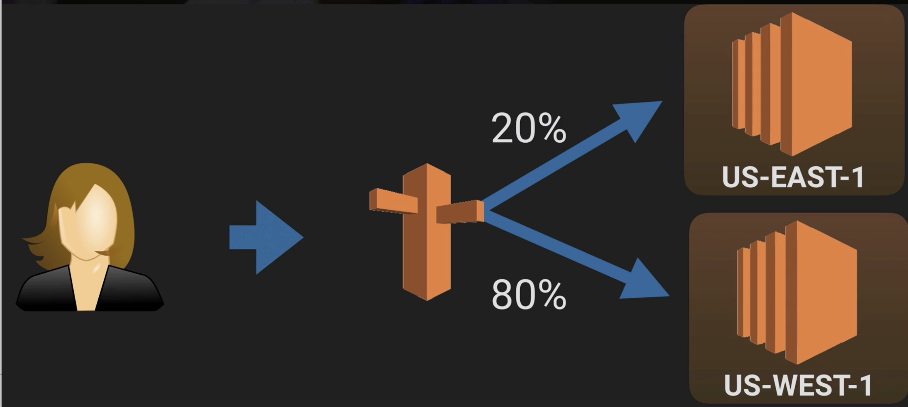
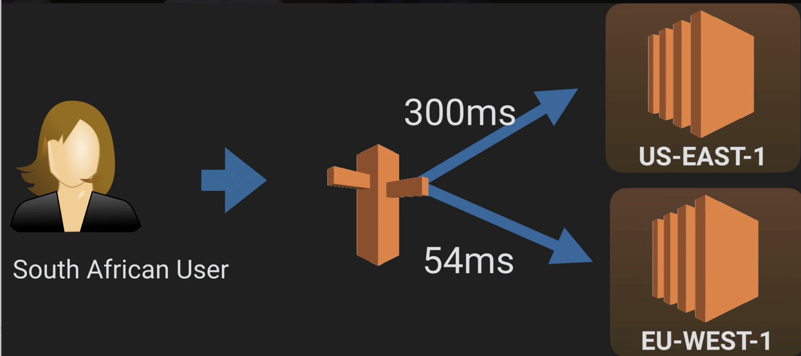
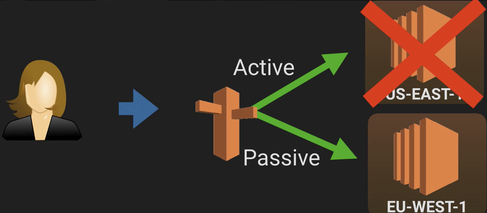
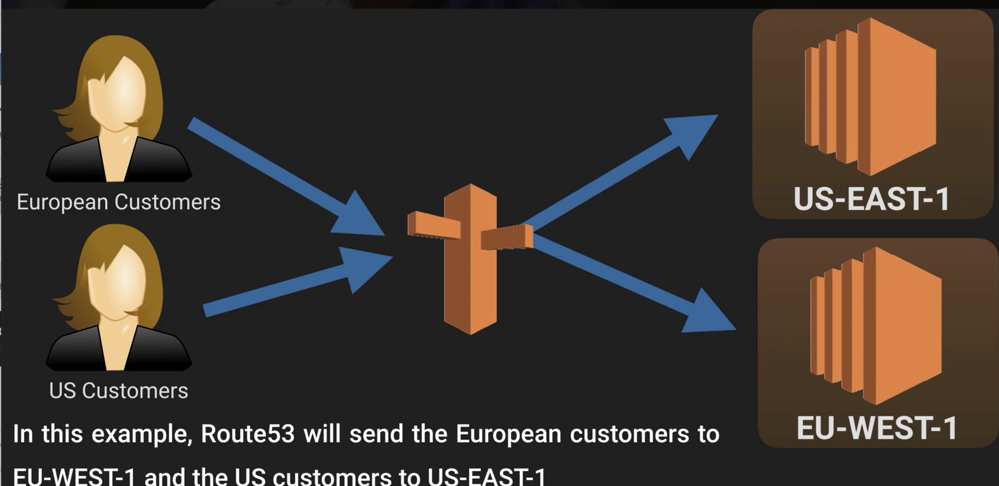

# Routing Policy

## Route53 Routing Policies 

* Simple 
* Weighted 
* Latency 
* Failover 
* Geolocation 

## Simple 

**This is the default routing policy when you create a new record set**. This is most commonly used when you have a **single resource that performs a given function for your domain**, for example, one web server that serves content for the `http://acloud.guru` website 

In this example Route53 will respond to DNS queries that are only in the record set ie **there is no intelligence built in to this response**. 

## Weighted 

**Weighted Routing Policies let you split your traffic based on different weights 
assigned.**

For example you can set 10% of your traffic to go to US-EAST-1 and 90% to go to EU-
WEST-1. 

## Latency 

**Latency based routing allows you to route your traffic based on the lowest network latency for your end user** (ie which region will give them the fastest response time). 

To use latency-based routing you create a latency resource record set for the Amazon EC2 (or ELB) resource in each region that hosts your website. 

**When Amazon Route 53 receives a query for your site, it selects the latency resource record set for the region that gives the user the lowest latency. Route 53 then responds with the value associated with that resource record set.** 

## Failover 

**Failover routing policies are used when you want to create an active/passive set up.**

For example you may want your `primary site` to be in `US-West-1` and your `secondary DR Site` in `US-East-1`. 

**Route53 will monitor the health of your primary site using a health check.** 

A health check monitors the health of our end points. 

## Geolocation

**Geolocation routing lets you choose where your traffic will be sent based on the geographic location of your users (ie the location from which DNS queries originate).**

For example, you might want all queries from Europe to be routed to a fleet of EC2 instances that are specifically configured for your European customers. These servers may have the local language of your European customers and all prices are displayed 
in Euros. 

## Exam Tips

### Remember the different routing policies and their use cases;

* Simple 
* Weighted 
* Latency 
* Failover 
* Geolocation 