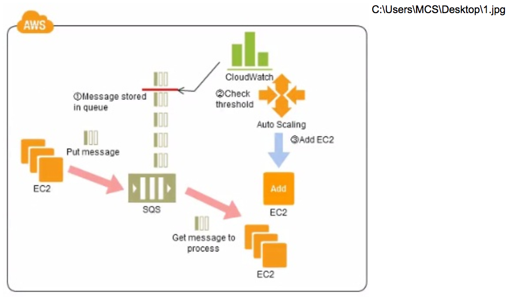

# AWS Certified Solutions Architect - Associate

### QUESTION NO: 1

A 3-tier e-commerce web application is current deployed on-premises and will be migrated to AWS for greater scalability and elasticity The web server currently shares read-only data using a network distributed file system The app server tier uses a clustering mechanism for discovery and shared session state that depends on IP multicast The database tier uses shared-storage clustering to provide database fall over capability, and uses several read slaves for scaling Data on all servers and the distributed file system directory is backed up weekly to off-site tapes

Which AWS storage and database architecture meets the requirements of the application?

A. Web servers, store read-only data in S3, and copy from S3 to root volume at boot time App servers snare state using a combination or DynamoDB and IP unicast Database use RDS with multi-AZ deployment and one or more Read Replicas Backup web and app servers backed up weekly via Mils database backed up via DB snapshots.

B. Web servers store -read-only data in S3, and copy from S3 to root volume at boot time App servers share state using a combination of DynamoDB and IP unicast Database, use RDS with multi-AZ deployment and one or more read replicas Backup web servers app servers, and database backed up weekly to Glacier using snapshots.

C. Web servers store read-only data In S3 and copy from S3 to root volume at boot time App servers share state using a combination of DynamoDB and IP unicast Database use RDS with multi-AZ deployment Backup web and app servers backed up weekly via AM is. database backed up via DB snapshots

D. Web servers, store read-only data in an EC2 NFS server, mount to each web server at boot time App servers share state using a combination of DynamoDB and IP multicast Database use RDS with multl-AZ deployment and one or more Read Replicas Backup web and app servers backed up weekly via Mils database backed up via DB snapshots

### QUESTION NO: 2
Your customer wishes to deploy an enterprise application to AWS which will consist of several web servers, several application servers and a small (50GB) Oracle database information is stored, both in the database and the file systems of the various servers. The backup system must support database recovery whole server and whole disk restores, and individual file restores with a recovery time of no more than two hours They have chosen to use RDS Oracle as the database

Which backup architecture will meet these requirements?

A. Backup RDS using automated daily DB backups Backup the EC2 instances using AMIs and supplement with file-level backup to S3 using traditional enterprise backup software to provide file level restore

B. Backup RDS using a Multi-AZ Deployment Backup the EC2 instances using Amis, and supplement by copying file system data to S3 to provide file level restore.

C. Backup RDS using automated daily DB backups Backup the EC2 instances using EBS snapshots and supplement with file-level backups to Amazon Glacier using traditional enterprise backup software to provide file level restore

D. Backup RDS database to S3 using Oracle RMAN Backup the EC2 instances using Amis, and supplement with EBS snapshots for individual volume restore.

### QUESTION NO: 3
Your company has HQ in Tokyo and branch offices all over the world and is using a logistics software with a multi-regional deployment on AWS in Japan, Europe and USA. The logistic software has a 3-tier architecture and currently uses MySQL 5.6 for data persistence. Each region has deployed its own database

In the HQ region you run an hourly batch process reading data from every region to compute cross-regional reports that are sent by email to all offices this batch process must be completed as fast as possible to quickly optimize logistics how do you build the database architecture in order to meet the requirements’?

A. For each regional deployment, use RDS MySQL with a master in the region and a read replica in the HQ region

B. For each regional deployment, use MySQL on EC2 with a master in the region and send hourly EBS snapshots to the HQ region

C. For each regional deployment, use RDS MySQL with a master in the region and send hourly RDS snapshots to the HQ region

D. For each regional deployment, use MySQL on EC2 with a master in the region and use S3 to copy data files hourly to the HQ region

E. Use Direct Connect to connect all regional MySQL deployments to the HQ region and reduce network latency for the batch process

### QUESTION NO: 4
A customer has a 10 GB AWS Direct Connect connection to an AWS region where they have a web application hosted on Amazon Elastic Computer Cloud (EC2). The application has dependencies on an on-premises mainframe database that uses a BASE (Basic Available. Sort stale Eventual consistency) rather than an ACID (Atomicity. Consistency isolation. Durability) consistency model. The application is exhibiting undesirable behavior because the database is not able to handle the volume of writes. How can you reduce the load on your on-premises database resources in the most cost-effective way?

A. Use an Amazon Elastic Map Reduce (EMR) S3DistCp as a synchronization mechanism between the on-premises database and a Hadoop cluster on AWS.

B. Modify the application to write to an Amazon SQS queue and develop a worker process to flush the queue to the on-premises database.

C. Modify the application to use DynamoDB to feed an EMR cluster which uses a map function to write to the on-premises database.

D. Provision an RDS read-replica database on AWS to handle the writes and synchronize the two databases using Data Pipeline.

### QUESTION NO: 5

Company B is launching a new game app for mobile devices. Users will log into the game using their existing social media account to streamline data capture. Company B would like to directly save player data and scoring information from the mobile app to a DynamoDS table named Score Data When a user saves their game the progress data will be stored to the Game state S3 bucket. what is the best approach for storing data to DynamoDB and S3?

A. Use an EC2 Instance that is launched with an EC2 role providing access to the Score Data DynamoDB table and the GameState S3 bucket that communicates with the mobile app via web services.

B. Use temporary security credentials that assume a role providing access to the Score Data DynamoDB table and the Game State S3 bucket using web identity federation.

C. Use Login with Amazon allowing users to sign in with an Amazon account providing the mobile app with access to the Score Data DynamoDB table and the Game State S3 bucket.

D. Use an 1AM user with access credentials assigned a role providing access to the Score Data DynamoDB table and the Game State S3 bucket for distribution with the mobile app.

### QUESTION NO: 6
Your company plans to host a large donation website on Amazon Web Services (AWS). You anticipate a large and undetermined amount of traffic that will create many database writes. To be certain that you do not drop any writes to a database hosted on AWS. Which service should you use?

A. Amazon RDS with provisioned IOPS up to the anticipated peak write throughput.

B. Amazon Simple Queue Service (SOS) for capturing the writes and draining the queue to write to the database.

C. Amazon ElastiCache to store the writes until the writes are committed to the database.

D. Amazon DynamoDB with provisioned write throughput up to the anticipated peak write throughput.

### QUESTION NO: 7
You have launched an EC2 instance with four (4) 500 GB EBS Provisioned IOPS volumes attached The EC2 Instance Is EBS-Optimized and supports 500 Mbps throughput between EC2 and EBS The two EBS volumes are configured as a single RAID o device, and each Provisioned IOPS volume is provisioned with 4.000 IOPS (4 000 16KB reads or writes) for a total of 16.000 random IOPS on the instance The EC2 Instance initially delivers the expected 16 000 IOPS random read and write performance Sometime later in order to increase the total random I/O performance of the instance, you add an additional two 500 GB EBS Provisioned IOPS volumes to the RAID Each volume Is provisioned to 4.000 lOPs like the original four for a total of 24.000 IOPS on the EC2 instance Monitoring shows that the EC2 instance CPU utilization increased from 50% to 70%. but the total random IOPS measured at the instance level does not increase at all.

What is the problem and a valid solution?

A. Larger storage volumes support higher Provisioned IOPS rates: increase the provisioned volume storage of each of the 6 EBS volumes to 1TB.

B. The EBS-Optimized throughput limits the total IOPS that can be utilized use an EBS-Optimized instance that provides larger throughput.

C. Small block sizes cause performance degradation, limiting the I'O throughput, configure the instance device driver and file system to use 64KB blocks to increase throughput.

D. RAID 0 only scales linearly to about 4 devices, use RAID 0 with 4 EBS Provisioned IOPS volumes but increase each Provisioned IOPS EBS volume to 6.000 IOPS.

E. The standard EBS instance root volume limits the total IOPS rate, change the instant root volume to also be a 500GB 4.000 Provisioned IOPS volume.

### QUESTION NO: 8
You have recently joined a startup company building sensors to measure street noise and air quality in urban areas.

The company has been running a pilot deployment of around 100 sensors for 3 months Each sensor uploads 1KB of sensor data every minute to a backend hosted on AWS.

During the pilot, you measured a peak or 10 IOPS on the database, and you stored an average of 3GB of sensor data per month in the database

The current deployment consists of a load-balanced auto scaled Ingestion layer using EC2 instances and a PostgreSQL RDS database with 500GB standard storage.

The pilot is considered a success and your CEO has managed to get the attention or some potential investors

The business plan requires a deployment of at least 1O0K sensors which needs to be supported by the backend

You also need to store sensor data for at least two years to be able to compare year over year Improvements.

To secure funding, you have to make sure that the platform meets these requirements and leaves room for further scaling

Which setup win meet the requirements?

A. Add an SOS queue to the ingestion layer to buffer writes to the RDS instance

B. Ingest data into a DynamoDB table and move old data to a Redshift cluster

C. Replace the RDS instance with a 6 node Redshift cluster with 96TB of storage

D. Keep the current architecture but upgrade RDS storage to 3TB and 10K provisioned IOPS

### QUESTION NO: 9
Your company is in the process of developing a next generation pet collar that collects biometric information to assist families with promoting healthy lifestyles for their pets Each collar will push 30kb of biometric data In JSON format every 2 seconds to a collection platform that will process and analyze the data providing health trending information back to the pet owners and veterinarians via a web portal Management has tasked you to architect the collection platform ensuring the following requirements are met.

Provide the ability for real-time analytics of the inbound biometric data

Ensure processing of the biometric data is highly durable. Elastic and parallel

The results of the analytic processing should be persisted for data mining

Which architecture outlined below win meet the initial requirements for the collection platform?

A. Utilize S3 to collect the inbound sensor data analyze the data from S3 with a daily scheduled Data Pipeline and save the results to a Redshift Cluster.

B. Utilize Amazon Kinesis to collect the inbound sensor data, analyze the data with Kinesis clients and save the results to a Redshift cluster using EMR.

C. Utilize SQS to collect the inbound sensor data analyze the data from SQS with Amazon Kinesis and save the results to a Microsoft SQL Server RDS instance.

D. Utilize EMR to collect the inbound sensor data, analyze the data from EUR with Amazon Kinesis and save me results to DynamoDB.

### QUESTION NO: 10
You need a persistent and durable storage to trace call activity of an IVR (Interactive Voice Response) system. Call duration is mostly in the 2-3 minutes timeframe. Each traced call can be either active or terminated. An external application needs to know each minute the list of currently active calls, which are usually a few calls/second. Put once per month there is a periodic peak up to 1000 calls/second for a few hours The system is open 24/7 and any downtime should be avoided. Historical data is periodically archived to files. Cost saving is a priority for this project.

What database implementation would better fit this scenario, keeping costs as low as possible?

A. Use RDS Multi-AZ with two tables, one for -Active calls" and one for -Terminated calls". In this way the "Active calls_ table is always small and effective to access.

B. Use DynamoDB with a "Calls" table and a Global Secondary Index on a "IsActive'" attribute that is present for active calls only In this way the Global Secondary index is sparse and more effective.

C. Use DynamoDB with a 'Calls" table and a Global secondary index on a 'State" attribute that can equal to "active" or "terminated" in this way the Global Secondary index can be used for all Items in the table.

D. Use RDS Multi-AZ with a "CALLS" table and an Indexed "STATE* field that can be equal to 'ACTIVE" or -TERMINATED" In this way the SOL query Is optimized by the use of the Index.

### QUESTION NO: 11
A web design company currently runs several FTP servers that their 250 customers use to upload and download large graphic files They wish to move this system to AWS to make it more scalable, but they wish to maintain customer privacy and Keep costs to a minimum.

What AWS architecture would you recommend?

A. ASK their customers to use an S3 client instead of an FTP client. Create a single S3 bucket Create an IAM user for each customer Put the IAM Users in a Group that has an IAM policy that permits access to sub-directories within the bucket via use of the 'username' Policy variable.

B. Create a single S3 bucket with Reduced Redundancy Storage turned on and ask their customers to use an S3 client instead of an FTP client Create a bucket for each customer with a Bucket Policy that permits access only to that one customer.

C. Create an auto-scaling group of FTP servers with a scaling policy to automatically scale-in when minimum network traffic on the auto-scaling group is below a given threshold. Load a central list of ftp users from S3 as part of the user Data startup script on each Instance.

D. Create a single S3 bucket with Requester Pays turned on and ask their customers to use an S3 client instead of an FTP client Create a bucket tor each customer with a Bucket Policy that permits access only to that one customer.

### QUESTION NO: 12
You have been asked to design the storage layer for an application. The application requires disk performance of at least 100,000 IOPS in addition, the storage layer must be able to survive the loss of an individual disk. EC2 instance, or Availability Zone without any data loss. The volume you provide must have a capacity of at least 3 TB. Which of the following designs will meet these objectives'?

A. Instantiate an 12 8xlarge instance in us-east-1a Create a RAID 0 volume using the four 800GB SSD ephemeral disks provided with the instance Provision 3x1 TB EBS volumes attach them to the instance and configure them as a second RAID 0 volume Configure synchronous, block-level replication from the ephemeral-backed volume to the EBS-backed volume.

B. Instantiate an 12 8xlarge instance in us-east-1a create a raid 0 volume using the four 800GB SSD ephemeral disks provide with the Instance Configure synchronous block-level replication to an Identically configured Instance in us-east-1b.

C. Instantiate a c3 8xlarge Instance In us-east-1 Provision an AWS Storage Gateway and configure it for 3 TB of storage and 100 000 lOPS Attach the volume to the instance.

D. Instantiate a c3 8xlarge instance in us-east-i provision 4x1TB EBS volumes, attach them to the instance, and configure them as a single RAID 5 volume Ensure that EBS snapshots are performed every 15 minutes.

E. Instantiate a c3 8xlarge Instance in us-east-1 Provision 3x1TB EBS volumes attach them to the instance, and configure them as a single RAID 0 volume Ensure that EBS snapshots are performed every 15 minutes.

### QUESTION NO: 13
You would like to create a mirror image of your production environment in another region for disaster recovery purposes. Which of the following AWS resources do not need to be recreated in the second region? (Choose 2 answers)

A. Route 53 Record Sets

B. IM1 Roles

C. Elastic IP Addresses (EIP)

D. EC2 Key Pairs

E. Launch configurations

F. Security Groups

### QUESTION NO: 14
Your company runs a customer facing event registration site This site is built with a 3-tier architecture with web and application tier servers and a MySQL database The application requires 6 web tier servers and 6 application tier servers for normal operation, but can run on a minimum of 65% server capacity and a single MySQL database. When deploying this application in a region with three availability zones (AZs) which architecture provides high availability?

A. A web tier deployed across 2 AZs with 3 EC2 (Elastic Compute Cloud) instances in each AZ inside an Auto Scaling Group behind an ELB (elastic load balancer), and an application tier deployed across 2 AZs with 3 EC2 instances in each AZ inside an Auto Scaling Group behind an ELB. and one RDS (Relational Database Service) instance deployed with read replicas in the other AZ.

B. A web tier deployed across 3 AZs with 2 EC2 (Elastic Compute Cloud) instances in each A2 inside an Auto Scaling Group behind an ELB (elastic load balancer) and an application tier deployed across 3 AZs with 2 EC2 instances in each AZ inside an Auto Scaling Group behind an ELB and one RDS (Relational Database Service) Instance deployed with read replicas in the two other AZs.

C. d A web tier deployed across 2 AZs with 3 EC2 (Elastic Compute Cloud) instances in each AZ inside an Auto Scaling Group behind an ELB (elastic load balancer) and an application tier deployed across 2 AZs with 3 EC2 instances m each AZ inside an Auto Scaling Group behind an ELS and a Multi-AZ RDS (Relational Database Service) deployment.

D. A web tier deployed across 3 AZs with 2 EC2 (Elastic Compute Cloud) instances in each AZ Inside an Auto Scaling Group behind an ELB (elastic load balancer). And an application tier deployed across 3 AZs with 2 EC2 instances In each AZ inside an Auto Scaling Group behind an ELB. And a Multi-AZ RDS (Relational Database services) deployment.

### QUESTION NO: 15
Your application is using an ELB in front of an Auto Scaling group of web/application servers deployed across two AZs and a Multi-AZ RDS Instance for data persistence.

The database CPU is often above 80% usage and 90% of I/O operations on the database are reads. To improve performance you recently added a single-node Memcached ElastiCache Cluster to cache frequent DB query results. In the next weeks the overall workload is expected to grow by 30%.

Do you need to change anything in the architecture to maintain the high availability or the application with the anticipated additional load'* Why?

A. Yes. you should deploy two Memcached ElastiCache Clusters in different AZs because the ROS Instance will not Be able to handle the load It me cache node fails.

B. No. if the cache node fails the automated ElastiCache node recovery feature will prevent any availability impact.

C. Yes you should deploy the Memcached ElastiCache Cluster with two nodes in the same AZ as the RDS DB master instance to handle the load if one cache node fails.

D. No if the cache node fails you can always get the same data from the DB without having any availability impact.

### QUESTION NO: 16
You are responsible for a legacy web application whose server environment is approaching end of life You would like to migrate this application to AWS as quickly as possible, since the application environment currently has the following limitations:

The VM's single 10GB VMDK is almost full

Me virtual network interface still uses the 10Mbps driver, which leaves your 100Mbps WAN connection completely underutilized

It is currently running on a highly customized. Windows VM within a VMware environment:

You do not have me installation media

This is a mission critical application with an RTO (Recovery Time Objective) of 8 hours. RPO (Recovery Point Objective) of 1 hour. How could you best migrate this application to AWS while meeting your business continuity requirements?

A. Use the EC2 VM Import Connector for vCenter to import the VM into EC2.

B. Use Import/Export to import the VM as an ESS snapshot and attach to EC2.

C. Use S3 to create a backup of the VM and restore the data into EC2.

D. Use me ec2-bundle-instance API to Import an Image of the VM into EC2

### QUESTION NO: 17
An International company has deployed a multi-tier web application that relies on DynamoDB in a single region For regulatory reasons they need disaster recovery capability In a separate region with a Recovery Time Objective of 2 hours and a Recovery Point Objective of 24 hours They should synchronize their data on a regular basis and be able to provision me web application rapidly using CloudFormation.

The objective is to minimize changes to the existing web application, control the throughput of DynamoDB used for the synchronization of data and synchronize only the modified elements.

Which design would you choose to meet these requirements?

A. Use AWS data Pipeline to schedule a DynamoDB cross region copy once a day. create a Lastupdated' attribute in your DynamoDB table that would represent the timestamp of the last update and use it as a filter.

B. Use EMR and write a custom script to retrieve data from DynamoDB in the current region using a SCAN operation and push it to QynamoDB in the second region.

C. Use AWS data Pipeline to schedule an export of the DynamoDB table to S3 in the current region once a day then schedule another task immediately after it that will import data from S3 to DynamoDB in the other region.

D. Send also each Ante

### QUESTION NO: 18

Refer to the architecture diagram above of a batch processing solution using Simple Queue Service (SOS) to set up a message queue between EC2 instances which are used as batch processors Cloud Watch monitors the number of Job requests (queued messages) and an Auto Scaling group adds or deletes batch servers automatically based on parameters set in Cloud Watch alarms. You can use this architecture to implement which of the following features in a cost effective and efficient manner?

A. Reduce the overall lime for executing jobs through parallel processing by allowing a busy EC2 instance that receives a message to pass it to the next instance in a daisy-chain setup.

B. Implement fault tolerance against EC2 instance failure since messages would remain in SQS and worn can continue with recovery of EC2 instances implement fault tolerance against SQS failure by backing up messages to S3.

C. Implement message passing between EC2 instances within a batch by exchanging messages through SOS.

D. Coordinate number of EC2 instances with number of job requests automatically thus Improving cost effectiveness.

E. Handle high priority jobs before lower priority jobs by assigning a priority metadata field to SQS messages.

### QUESTION NO: 19
Your company currently has a 2-tier web application running in an on-premises data center. You have experienced several infrastructure failures in the past two months resulting in significant financial losses. Your CIO is strongly agreeing to move the application to AWS. While working on achieving buy-in from the other company executives, he asks you to develop a disaster recovery plan to help improve Business continuity in the short term. He specifies a target Recovery Time Objective (RTO) of 4 hours and a Recovery Point Objective (RPO) of 1 hour or less. He also asks you to implement the solution within 2 weeks. Your database is 200GB in size and you have a 20Mbps Internet connection. How would you do this while minimizing costs?

A. Create an EBS backed private AMI which includes a fresh install or your application. Setup a script in your data center to backup the local database every 1 hour and to encrypt and copy the resulting file to an S3 bucket using multi-part upload.

B. Install your application on a compute-optimized EC2 instance capable of supporting the application's average load synchronously replicate transactions from your on-premises database to a database instance in AWS across a secure Direct Connect connection.

C. Deploy your application on EC2 instances within an Auto Scaling group across multiple availability zones asynchronously replicate transactions from your on-premises database to a database instance in AWS across a secure VPN connection.

D. Create an EBS backed private AMI that includes a fresh install of your application. Develop a Cloud Formation template which includes your Mil and the required EC2. Auto-Scaling and ELB resources to support deploying the application across Multiple-Ability Zones. Asynchronously replicate transactions from your on-premises database to a database instance in AWS across a secure VPN connection.

### QUESTION NO: 20
An ERP application is deployed across multiple AZs in a single region. In the event of failure, the Recovery Time Objective (RTO) must be less than 3 hours, and the Recovery Point Objective (RPO) must be 15 minutes the customer realizes that data corruption occurred roughly 1.5 hours ago.

What DR strategy could be used to achieve this RTO and RPO in the event of this kind of failure?

A. Take hourly DB backups to S3, with transaction logs stored in S3 every 5 minutes.

B. Use synchronous database master-slave replication between two availability zones.

C. Take hourly DB backups to EC2 Instance store volumes with transaction logs stored In S3 every 5 minutes.

D. Take 15 minute DB backups stored In Glacier with transaction logs stored in S3 every 5 minutes.

### QUESTION NO: 21
Your startup wants to implement an order fulfillment process for selling a personalized gadget that needs an average of 3-4 days to produce with some orders taking up to 6 months you expect 10 orders per day on your first day. 1000 orders per day after 6 months and 10,000 orders after 12 months.

Orders coming in are checked for consistency men dispatched to your manufacturing plant for production quality control packaging shipment and payment processing If the product does not meet the quality standards at any stage of the process employees may force the process to repeat a step Customers are notified via email about order status and any critical issues with their orders such as payment failure.

Your case architecture includes AWS Elastic Beanstalk for your website with an RDS MySQL instance for customer data and orders.

How can you implement the order fulfillment process while making sure that the emails are delivered reliably?

A. Add a business process management application to your Elastic Beanstalk app servers and re-use the ROS database for tracking order status use one of the Elastic Beanstalk instances to send emails to customers.

B. Use SWF with an Auto Scaling group of activity workers and a decider instance in another Auto Scaling group with min/max=1 Use the decider instance to send emails to customers.

C. Use SWF with an Auto Scaling group of activity workers and a decider instance in another Auto Scaling group with min/max=1 use SES to send emails to customers.

D. Use an SQS queue to manage all process tasks Use an Auto Scaling group of EC2 Instances that poll the tasks and execute them. Use SES to send emails to customers.

### QUESTION NO: 22
You have deployed a web application targeting a global audience across multiple AWS Regions under the domain name.example.com. You decide to use Route53 Latency-Based Routing to serve web requests to users from the region closest to the user. To provide business continuity in the event of server downtime you configure weighted record sets associated with two web servers in separate Availability Zones per region. Dunning a DR test you notice that when you disable all web servers in one of the regions Route53 does not automatically direct all users to the other region. What could be happening? (Choose 2 answers)

A. Latency resource record sets cannot be used in combination with weighted resource record sets.

B. You did not setup an http health check tor one or more of the weighted resource record sets associated with me disabled web servers.

C. The value of the weight associated with the latency alias resource record set in the region with the disabled servers is higher than the weight for the other region.

D. One of the two working web servers in the other region did not pass its HTTP health check.

E. You did not set "Evaluate Target Health" to "Yes" on the latency alias resource record set associated with example com in the region where you disabled the servers.

### QUESTION NO: 23
Your company hosts a social media site supporting users in multiple countries. You have been asked to provide a highly available design tor the application that leverages multiple regions tor the most recently accessed content and latency sensitive portions of the wet) site The most latency sensitive component of the application involves reading user preferences to support web site personalization and ad selection.

In addition to running your application in multiple regions, which option will support this application’s requirements?

A. Serve user content from S3. CloudFront and use Route53 latency-based routing between ELBs in each region Retrieve user preferences from a local DynamoDB table in each region and leverage SQS to capture changes to user preferences with SOS workers for propagating updates to each table.

B. Use the S3 Copy API to copy recently accessed content to multiple regions and serve user content from S3. CloudFront with dynamic content and an ELB in each region Retrieve user preferences from an ElasticCache cluster in each region and leverage SNS notifications to propagate user preference changes to a worker node in each region.

C. Use the S3 Copy API to copy recently accessed content to multiple regions and serve user content from S3 CloudFront and Route53 latency-based routing Between ELBs In each region Retrieve user preferences from a DynamoDB table and leverage SQS to capture changes to user preferences with SOS workers for propagating DynamoDB updates.

D. Serve user content from S3. CloudFront with dynamic content, and an ELB in each region Retrieve user preferences from an ElastiCache cluster in each region and leverage Simple Workflow (SWF) to manage the propagation of user preferences from a centralized OB to each ElastiCache cluster.

### QUESTION NO: 24
Your system recently experienced down time during the troubleshooting process. You found that a new administrator mistakenly terminated several production EC2 instances.

Which of the following strategies will help prevent a similar situation in the future?

The administrator still must be able to:

- launch, start stop, and terminate development resources.

- launch and start production instances.

A. Create an IAM user, which is not allowed to terminate instances by leveraging production EC2 termination protection.

B. Leverage resource based tagging along with an IAM user, which can prevent specific users from terminating production EC2 resources.

C. Leverage EC2 termination protection and multi-factor authentication, which together require users to authenticate before terminating EC2 instances

D. Create an 1AM user and apply an 1AM role which prevents users from terminating production EC2 instances.

### QUESTION NO: 25
A customer has established an AWS Direct Connect connection to AWS. The link is up and routes are being advertised from the customer's end, however the customer is unable to connect from EC2 instances inside its VPC to servers residing in its datacenter.

Which of the following options provide a viable solution to remedy this situation? (Choose 2 answers)

A. Add a route to the route table with an iPsec VPN connection as the target.

B. Enable route propagation to the virtual pinnate gateway (VGW).

C. Enable route propagation to the customer gateway (CGW).

D. Modify the route table of all Instances using the 'route' command.

E. Modify the Instances VPC subnet route table by adding a route back to the customer's on-premises environment.

### QUESTION NO: 26
Your company previously configured a heavily used, dynamically routed VPN connection between your on-premises data center and AWS. You recently provisioned a DirectConnect connection and would like to start using the new connection. After configuring DirectConnect settings in the AWS Console, which of the following options win provide the most seamless transition for your users?

A. Delete your existing VPN connection to avoid routing loops configure your DirectConnect router with the appropriate settings and verity network traffic is leveraging DirectConnect.

B. Configure your DireclConnect router with a higher 8GP priority man your VPN router, verify network traffic is leveraging Directconnect and then delete your existing VPN connection.

C. Update your VPC route tables to point to the DirectConnect connection configure your DirectConnect router with the appropriate settings verify network traffic is leveraging DirectConnect and then delete the VPN connection.

D. Configure your DireclConnect router, update your VPC route tables to point to the DirectConnect connection, configure your VPN connection with a higher BGP pointy. And verify network traffic is leveraging the DirectConnect connection.

### QUESTION NO: 27
A web company is looking to implement an external payment service into their highly available application deployed in a VPC Their application EC2 instances are behind a public lacing ELB Auto scaling is used to add additional instances as traffic increases under normal load the application runs 2 instances in the Auto Scaling group but at peak it can scale 3x in size. The application instances need to communicate with the payment service over the Internet which requires whitelisting of all public IP addresses used to communicate with it. A maximum of 4 whitelisting IP addresses are allowed at a time and can be added through an API.

How should they architect their solution?

A. Route payment requests through two NAT instances setup for High Availability and whitelist the Elastic IP addresses attached to the MAT instances.

B. Whitelist the VPC Internet Gateway Public IP and route payment requests through the Internet Gateway.

C. Whitelist the ELB IP addresses and route payment requests from the Application servers through the ELB.

D. Automatically assign public IP addresses to the application instances in the Auto Scaling group and run a script on boot that adds each instances public IP address to the payment validation whitelist API.

### QUESTION NO: 28
You are designing the network infrastructure for an application server in Amazon VPC Users will access all the application instances from the Internet as well as from an on-premises network The on-premises network is connected to your VPC over an AWS Direct Connect link.

How would you design routing to meet the above requirements?

A. Configure a single routing Table with a default route via the Internet gateway Propagate a default route via BGP on the AWS Direct Connect customer router Associate the routing table with all VPC subnets.

B. Configure a single routing table with a default route via the internet gateway Propagate specific routes for the on-premises networks via BGP on the AWS Direct Connect customer router Associate the routing table with all VPC subnets.

C. Configure a single routing table with two default routes: one to the internet via an Internet gateway the other to the on-premises network via the VPN gateway use this routing table across all subnets in your VPC.

D. Configure two routing tables one that has a default route via the Internet gateway and another that has a default route via the VPN gateway Associate both routing tables with each VPC subnet.

### QUESTION NO: 29
You are implementing AWS Direct Connect. You intend to use AWS public service end points such as Amazon S3, across the AWS Direct Connect link. You want other Internet traffic to use your existing link to an Internet Service Provider.

What is the correct way to configure AWS Direct connect for access to services such as Amazon S3?

A. Configure a public Interface on your AWS Direct Connect link Configure a static route via your AWS Direct Connect link that points to Amazon S3 Advertise a default route to AWS using BGP.

B. Create a private interface on your AWS Direct Connect link. Configure a static route via your AWS Direct connect link that points to Amazon S3 Configure specific routes to your network in your VPC.

C. Create a public interface on your AWS Direct Connect link Redistribute BGP routes into your existing routing infrastructure advertise specific routes for your network to AWS.

D. Create a private interface on your AWS Direct connect link. Redistribute BGP routes into your existing routing infrastructure and advertise a default route to AWS.

### QUESTION NO: 30
You have deployed a three-tier web application in a VPC with a CIOR block of 10 0 0 0/28 You initially deploy two web servers, two application servers, two database servers and one NAT instance tor a total of seven EC2 instances The web. Application and database servers are deployed across two availability zones (AZs). You also deploy an ELB in front of the two web servers, and use Route53 for DNS Web (raffle gradually increases in the first few days following the deployment, so you attempt to double the number of instances in each tier of the application to handle the new load unfortunately some of these new instances fail to launch.

Which of the following could De the root caused? (Choose 2 answers)

A. The Internet Gateway (IGW) of your VPC has scaled-up adding more instances to handle the traffic spike, reducing the number of available private IP addresses for new instance launches.

B. AWS reserves one IP address In each subnet's CIDR block for Route53 so you do not have enough addresses left to launch all of the new EC2 instances.

C. AWS reserves the first and the last private IP address in each subnet's CIDR block so you do not have enough addresses left to launch all of the new EC2 instances.

D. The ELB has scaled-up. Adding more instances to handle the traffic reducing the number of available private IP addresses for new instance launches.

E. AWS reserves the first tour and the last IP address in each subnet's CIDR block so you do not have enough addresses left to launch all of the new EC2 instances.

### QUESTION NO: 31
You've been brought in as solutions architect to assist an enterprise customer with their migration of an e-commerce platform to Amazon Virtual Private Cloud (VPC) The previous architect has already deployed a 3-tier VPC.

The configuration is as follows:

VPC vpc-2f8t>C447

IGVV ig-2d8bc445

NACL acl-2080c448

Subnets and Route Tables:

Web server’s subnet-258Dc44d

Application server’s suDnet-248bc44c

Database server’s subnet-9189c6f9

Route Tables:

rrb-218DC449

rtb-238bc44b

Associations:

subnet-258bc44d: rtb-2i8bc449

Subnet-248DC44C rtb-238tX44b

subnet-9189c6f9 rtb-238Dc 44b

You are now ready to begin deploying EC2 instances into the VPC Web servers must have direct access to the internet Application and database servers cannot have direct access to the internet.

Which configuration below will allow you the ability to remotely administer your application and database servers, as well as allow these servers to retrieve updates from the Internet?

A. Create a bastion and NAT Instance in subnet-248bc44c and add a route from rtb-238bc44b to subnet-258bc44d.

B. Add a route from rtD-238bc44D to igw-2d8bc445 and add a bastion and NAT instance within suonet-248bc44c.

C. Create a bastion and MAT Instance In subnet-258bc44d. Add a route from rtb-238bc44b to igw-2d8bc445. And a new NACL that allows access between subnet-258bc44d and subnet-248bc44c.

D. Create a bastion and mat instance in suDnet-258Dc44d and add a route from rtD-238Dc44D to the mat instance.

### QUESTION NO: 32
You are designing Internet connectivity for your VPC. The Web servers must be available on the Internet. The application must have a highly available architecture.

Which alternatives should you consider? (Choose 2 answers)

A. Configure a NAT instance in your VPC Create a default route via the NAT instance and associate it with all subnets Configure a DNS A record that points to the NAT instance public IP address.

B. Configure a CloudFront distribution and configure the origin to point to the private IP addresses of your Web servers Configure a Route53 CNAME record to your CloudFront distribution.

C. Place all your web servers behind EL8 Configure a Route53 CNMIE to point to the ELB DNS name.

D. Assign BPs to all web servers. Configure a Route53 record set with all EIPs. With health checks and DNS failover.

E. Configure ELB with an EIP Place all your Web servers behind ELB Configure a Route53 A record that points to the EIP.

### QUESTION NO: 33
You are tasked with moving a legacy application from a virtual machine running Inside your datacenter to an Amazon VPC Unfortunately this app requires access to a number of on-premises services and no one who configured the app still works for your company. Even worse there's no documentation for it. What will allow the application running inside the VPC to reach back and access its internal dependencies without being reconfigured? (Choose 3 answers)

A. An AWS Direct Connect link between the VPC and the network housing the internal services.

B. An Internet Gateway to allow a VPN connection.

C. An Elastic IP address on the VPC instance

D. An IP address space that does not conflict with the one on-premises

E. Entries in Amazon Route 53 that allow the Instance to resolve its dependencies' IP addresses

F. A VM Import of the current virtual machine

### QUESTION NO: 34
You are migrating a legacy client-server application to AWS The application responds to a specific DNS domain (e g www example com) and has a 2-tier architecture, with multiple application servers and a database server Remote clients use TCP to connect to the application servers. The application servers need to know the IP address of the clients in order to function properly and are currently taking that information from the TCP socket A Multi-AZ RDS MySQL instance will be used for the database.

During the migration you can change the application code but you have to file a change request.

How would you implement the architecture on AWS In order to maximize scalability and high ability?

A. File a change request to implement Proxy Protocol support In the application Use an EL8 with a TCP Listener and Proxy Protocol enabled to distribute load on two application servers in different AZs.

B. File a change request to Implement Cross-Zone support in the application Use an EL8 with a TCP Listener and Cross-Zone Load Balancing enabled, two application servers in different AZs.

C. File a change request to implement Latency Based Routing support in the application Use Route 53 with Latency Based Routing enabled to distribute load on two application servers in different AZs.

D. File a change request to implement Alias Resource support in the application Use Route 53 Alias Resource Record to distribute load on two application servers in different AZs.

### QUESTION NO: 35
A newspaper organization has a on-premises application which allows the public to search its back catalogue and retrieve individual newspaper pages via a website written in Java They have scanned the old newspapers into JPEGs (approx 17TB) and used Optical Character Recognition (OCR) to populate a commercial search product. The hosting platform and software are now end of life and the organization wants to migrate Its archive to AWS and produce a cost efficient architecture and still be designed for availability and durability Which is the most appropriate?

A. Use S3 with reduced redundancy lo store and serve the scanned files, install the commercial search application on EC2 Instances and configure with auto-scaling and an Elastic Load Balancer.

B. Model the environment using CloudFormation use an EC2 instance running Apache webserver and an open source search application, stripe multiple standard EBS volumes together to store the JPEGs and search index.

C. Use S3 with standard redundancy to store and serve the scanned files, use CloudSearch for query processing, and use Elastic Beanstalk to host the website across multiple availability zones.

D. Use a single-AZ RDS MySQL instance lo store the search index 33d the JPEG images use an EC2 instance to serve the website and translate user queries into SQL.

E. Use a CloudFront download distribution to serve the JPEGs to the end users and Install the current commercial search product, along with a Java Container Tor the website on EC2 instances and use Route53 with DNS round-robin.

### QUESTION NO: 36
A corporate web application is deployed within an Amazon Virtual Private Cloud (VPC) and is connected to the corporate data center via an iPsec VPN. The application must authenticate against the on-premises LDAP server. After authentication, each logged-in user can only access an Amazon Simple Storage Space (S3) keyspace specific to that user.

Which two approaches can satisfy these objectives? (Choose 2 answers)

A. Develop an identity broker that authenticates against 1AM security Token service to assume a IAM role in order to get temporary AWS security credentials The application calls the identity broker to get AWS temporary security credentials with access to the appropriate S3 bucket.

B. The application authenticates against LOAP and retrieves the name of an IAM role associated with the user. The application then cails the IAM Security Token Service to assume that IAM role The application can use the temporary credentials to access the appropriate S3 bucket.

C. Develop an identity broker that authenticates against LDAP and then calls 1AM Security Token Service to get 1AM federated user credentials The application calls the identity broker to get IAM federated user credentials with access to the appropriate S3 bucket.

D. The application authenticates against LDAP the application then calls the AWS identity and Access Management (IAM) Security service to log in to 1AM using the LDAP credentials the application can use the IAM temporary credentials to access the appropriate S3 bucket.

E. The application authenticates against IAM Security Token Service using the LDAP credentials the application uses those temporary AWS security credentials to access the appropriate S3 bucket.

### QUESTION NO: 37
You are designing a multi-platform web application for AWS The application will run on EC2 instances and will be accessed from PCs. tablets and smart phones Supported accessing platforms are Windows. MACOS. IOS and Android Separate sticky session and SSL certificate setups are required for different platform types which of the following describes the most cost effective and performance efficient architecture setup?

A. Setup a hybrid architecture to handle session state and SSL certificates on-prem and separate EC2 Instance groups running web applications for different platform types running in a VPC.

B. Set up one ELB for all platforms to distribute load among multiple instance under it Each EC2 instance implements ail functionality for a particular platform.

C. Set up two ELBs The first ELB handles SSL certificates for all platforms and the second ELB handles session stickiness for all platforms for each ELB run separate EC2 instance groups to handle the web application for each platform.

D. Assign multiple ELBS to an EC2 instance or group of EC2 instances running the common components of the web application, one ELB for each platform type Session stickiness and SSL termination are done at the ELBs.

### QUESTION NO: 38
Your company has an on-premises multi-tier PHP web application, which recently experienced downtime due to a large burst In web traffic due to a company announcement Over the coming days, you are expecting similar announcements to drive similar unpredictable bursts, and are looking to find ways to quickly improve your infrastructures ability to handle unexpected increases in traffic.

The application currently consists of 2 tiers A web tier which consists of a load balancer and several Linux Apache web servers as well as a database tier which hosts a Linux server hosting a MySQL database.

Which scenario below will provide full site functionality, while helping to improve the ability of your application in the short timeframe required?

A. Offload traffic from on-premises environment Setup a CloudFront distribution and configure CloudFront to cache objects from a custom origin Choose to customize your object cache behavior, and select a TTL that objects should exist in cache.

B. Migrate to AWS Use VM import ‘Export to quickly convert an on-premises web server to an AMI create an Auto Scaling group, which uses the imported AMI to scale the web tier based on incoming traffic Create an RDS read replica and setup replication between the RDS instance and on-premises MySQL server to migrate the database.

C. Failover environment: Create an S3 bucket and configure it tor website hosting Migrate your DNS to Route53 using zone (lie import and leverage Route53 DNS failover to failover to the S3 hosted website.

D. Hybrid environment Create an AMI which can be used of launch web serfers in EC2 Create an Auto Scaling group which uses the * AMI to scale the web tier based on incoming traffic Leverage Elastic Load Balancing to balance traffic between on-premises web servers and those hosted in AWS.

### QUESTION NO: 39

Your company produces customer commissioned one-of-a-kind skiing helmets combining nigh fashion with custom technical enhancements Customers can show oft their Individuality on the ski slopes and have access to head-up-displays. GPS rear-view cams and any other technical innovation they wish to embed in the helmet.

The current manufacturing process is data rich and complex including assessments to ensure that the custom electronics and materials used to assemble the helmets are to the highest standards Assessments are a mixture of human and automated assessments you need to add a new set of assessment to model the failure modes of the custom electronics using GPUs with CUDA. across a cluster of servers with low latency networking.

What architecture would allow you to automate the existing process using a hybrid approach and ensure that the architecture can support the evolution of processes over time?

A. Use AWS Data Pipeline to manage movement of data & meta-data and assessments Use an auto-scaling group of G2 instances in a placement group.

B. Use Amazon Simple Workflow (SWF) 10 manages assessments, movement of data & meta-data Use an auto-scaling group of G2 instances in a placement group.

C. Use Amazon Simple Workflow (SWF) lo manages assessments movement of data & meta-data Use an auto-scaling group of C3 instances with SR-IOV (Single Root I/O Virtualization).

D. Use AWS data Pipeline to manage movement of data & meta-data and assessments use auto-scaling group of C3 with SR-IOV (Single Root I/O virtualization).

### QUESTION NO: 40
You're running an application on-premises due to its dependency on non-x86 hardware and want to use AWS for data backup. Your backup application is only able to write to POSIX-compatible block-based storage. You have 140TB of data and would like to mount it as a single folder on your file server Users must be able to access portions of this data while the backups are taking place. What backup solution would be most appropriate for this use case?

A. Use Storage Gateway and configure it to use Gateway Cached volumes.

B. Configure your backup software to use S3 as the target for your data backups.

C. Configure your backup software to use Glacier as the target for your data backups.

D. Use Storage Gateway and configure it to use Gateway Stored volumes.