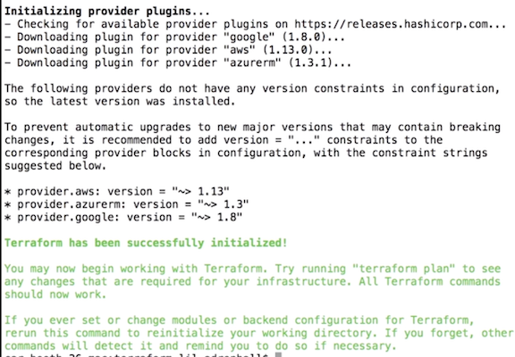
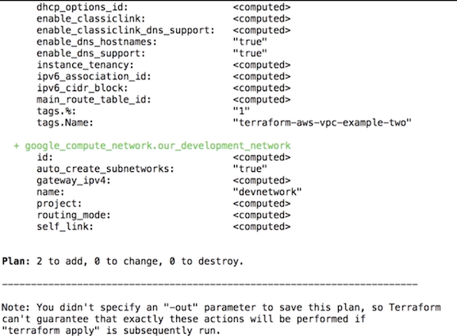
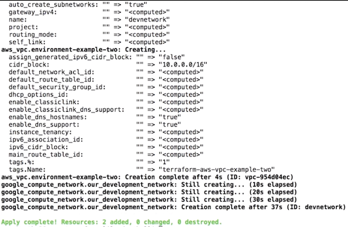
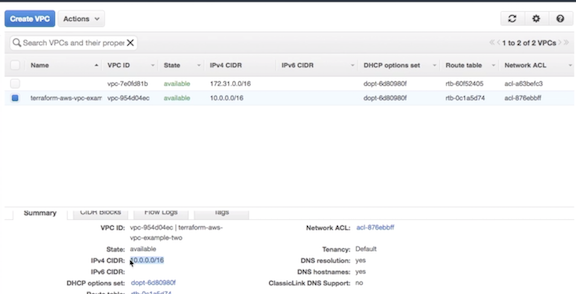

# Setting up Terraform

## Installing Terraform

```
$ mkdir terraform
$ cd terraform
$ wget https://releases.hashicorp.com/terraform/0.11.13/terraform_0.11.13_linux_amd64.zip
--2019-03-15 06:35:51--  https://releases.hashicorp.com/terraform/0.11.13/terraform_0.11.13_linux_amd64.zip
Resolving releases.hashicorp.com (releases.hashicorp.com)... 151.101.37.183, 2a04:4e42:9::439
Connecting to releases.hashicorp.com (releases.hashicorp.com)|151.101.37.183|:443... connected.
HTTP request sent, awaiting response... 200 OK
Length: 21128942 (20M) [application/zip]
Saving to: ‘terraform_0.11.13_linux_amd64.zip’

100%[=====================================================================================================================>] 21,128,942   422KB/s   in 39s

2019-03-15 06:36:31 (530 KB/s) - ‘terraform_0.11.13_linux_amd64.zip’ saved [21128942/21128942]

$ unzip terraform_0.11.13_linux_amd64.zip
$ unzip terraform_0.11.13_linux_amd64.zip
```

```
$ ls -la
total 104644
drwxrwxr-x  2 vagrant vagrant     4096 Mar 15 06:38 .
drwxr-xr-x 15 vagrant vagrant     4096 Mar 15 06:42 ..
-rwxrwxr-x  1 vagrant vagrant 86015168 Mar 12 18:37 terraform
-rw-rw-r--  1 vagrant vagrant 21128942 Mar 12 19:19 terraform_0.11.13_linux_amd64.zip

# pwd
/home/vagrant/terraform
```

### Set Terraform

**Path - Windows**

Go to `Control Panel` -> `System` -> `System Settings` -> `Environment Variables`
 
Scroll down in system variables until you find PATH Click Edit... and change accordingly 


**Path - Posix**

* The command path needs to be added to your `~/.bash` profile (macOS), `~/.profile`, or `~/bashrc` file 
• Add `export PATH=$PATH:path/to/dir` so the executable can be called from anywhere within the file structure 
• Load the file with `source ~/.bash_profile` (or your particular file) 


```
$ vi ~/.bashrc
export PATH=$PATH:/home/vagrant/terraform/
$ source ~/.bashrc
```

### Run Terraform

```
$ terraform
Usage: terraform [-version] [-help] <command> [args]

The available commands for execution are listed below.
The most common, useful commands are shown first, followed by
less common or more advanced commands. If you're just getting
started with Terraform, stick with the common commands. For the
other commands, please read the help and docs before usage.

Common commands:
    apply              Builds or changes infrastructure
    console            Interactive console for Terraform interpolations
    destroy            Destroy Terraform-managed infrastructure
    env                Workspace management
    fmt                Rewrites config files to canonical format
    get                Download and install modules for the configuration
    graph              Create a visual graph of Terraform resources
    import             Import existing infrastructure into Terraform
    init               Initialize a Terraform working directory
    output             Read an output from a state file
    plan               Generate and show an execution plan
    providers          Prints a tree of the providers used in the configuration
    push               Upload this Terraform module to Atlas to run
    refresh            Update local state file against real resources
    show               Inspect Terraform state or plan
    taint              Manually mark a resource for recreation
    untaint            Manually unmark a resource as tainted
    validate           Validates the Terraform files
    version            Prints the Terraform version
    workspace          Workspace management

All other commands:
    debug              Debug output management (experimental)
    force-unlock       Manually unlock the terraform state
    state              Advanced state management
```

### Check Terraform version

```
$ terraform version
Terraform v0.11.13

```


## Terraform initialization

**`connections.tf`**

```
provider "google" {
  credentials = "${file("../account.json")}"
  project     = "thrashingcorecode"
  region      = "us-west1"
}

provider "aws" {
  region = "us-west-2"
}

provider "azurerm" {
  subscription_id = "0"
  client_id       = "1"
  client_secret   = "2"
  tenant_id       = "3"
}
```

`$ terraform init`




**It will go through and look at the specific providers, determine which plugins are needed for those providers, download them and put them into the directory**


## Hello World

`resources.tf`

```
resource "google_compute_network" "our_development_network" { 
	name = "devnetwork" 
	auto_create_subnetworks = true 
} 

resource "aws_vpc" "environment-example-two" { 
	cidr_block = "10.0.0.0/16" 
	enable_dns_hostnames = true 
	enable.dns_support = true 
	tags { 
		Name = "terraform-aws-vpc-example-two" 
	}
}
```

**`$ terraform plan`** => Run of check

What this will do, is now go out against the provider's other resources to determine **if any of the newly resourced specifications that have been added are existing, or not existing,** 

**If there's any conflicts**, and **it will determine a diff between what is existing in the providers**, and what we're trying to add to that particular environment. 



**In this particular situation, we have two brand new resources to add**, nothing to change, and nothing to destroy. So since we know this is what we want, I'll go ahead and type in `terraform apply`. Which will apply the diff to the particular platforms. 

It will go through, and it effectively runs another plan, just to make sure nothing has changed in the meantime. And nothing has, we still want those two things added。

**`$terraform apply`**



We go to AWS, and we go to VPC, we can see that there is now the default VPC which comes with the account, and then the one that we created right here. Below, you can see some of the properties and here is the IP that we set, for the CIDR range.




