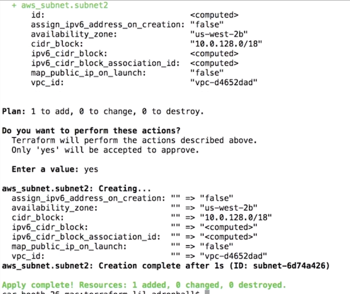
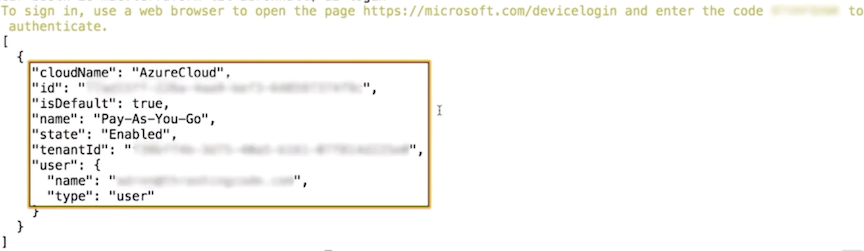

# Build Ecosystem one (Add aws subnet and Azure subnet)

## 1.Adding subnet works

A subnet basically gives you a specific network within the overall network that's specific to a data center. And in the case of AWS, the advantage of doing something like that is you know the specific name of the subnet then and you can also give it a **specific CIDR block** that you control versus one that's you know, automatically created. 

`resources.tf`

```
resource "google_compute_network" "our_development_network" { 
	name = "devnetwork" 
	auto_create_subnetworks = true 
} 

resource "aws_vpc" "environment-example-two" { 
	cidr_block = "10.0.0.0/16" 
	enable_dns_hostnames = true 
	enable.dns_support = true 
	tags { 
		Name = "terraform-aws-vpc-example-two" 
	}
}

resource "aws_subnet" "subnet1" { 
	cidr_block = "${cidrsubnet(aws_vpc.environment-example-two.cidr_block, 3, 1)}" 
	vpc_id = "${aws_vpc.environment-example-two.id}" 
	availability_zone = "us-west-2a" 
}
```

**`$ terraform plan`** 


* `aws_subnet` added
* Nothing add to `gcp`


**`$ terraform apply`**


 


### Add another subnet

`resources.tf`

```
resource "google_compute_network" "our_development_network" { 
	name = "devnetwork" 
	auto_create_subnetworks = true 
} 

resource "aws_vpc" "environment-example-two" { 
	cidr_block = "10.0.0.0/16" 
	enable_dns_hostnames = true 
	enable.dns_support = true 
	tags { 
		Name = "terraform-aws-vpc-example-two" 
	}
}

resource "aws_subnet" "subnet1" { 
	cidr_block = "${cidrsubnet(aws_vpc.environment-example-two.cidr_block, 3, 1)}" 
	vpc_id = "${aws_vpc.environment-example-two.id}" 
	availability_zone = "us-west-2a" 
}

resource "aws_subnet" "subnet2" { 
	cidr_block = "${cidrsubnet(aws_vpc.environment-example-two.cidr_block, 2, 2)}" 
	vpc_id = "${aws_vpc.environment-example-two.id}" 
	availability_zone = "us-west-2b" 
}
```

**`$ terraform apply`**



### you can add specific security groups and other things to that subnet. 

`resources.tf`

```
resource "google_compute_network" "our_development_network" { 
	name = "devnetwork" 
	auto_create_subnetworks = true 
} 

resource "aws_vpc" "environment-example-two" { 
	cidr_block = "10.0.0.0/16" 
	enable_dns_hostnames = true 
	enable.dns_support = true 
	tags { 
		Name = "terraform-aws-vpc-example-two" 
	}
}

resource "aws_subnet" "subnet1" { 
	cidr_block = "${cidrsubnet(aws_vpc.environment-example-two.cidr_block, 3, 1)}" 
	vpc_id = "${aws_vpc.environment-example-two.id}" 
	availability_zone = "us-west-2a" 
}

resource "aws_subnet" "subnet2" { 
	cidr_block = "${cidrsubnet(aws_vpc.environment-example-two.cidr_block, 2, 2)}" 
	vpc_id = "${aws_vpc.environment-example-two.id}" 
	availability_zone = "us-west-2b" 
}

resource "aws_security_group" "subnetsecurity" { 
	vpc_id = "${aws_vpc.envlronment-example-two.id}" 
   
   ingress { 
   	  cidr_blocks = [ 
   	    "${aws_vpc.environment-example-two.cidr_block}" 
   	  ]
   	
   	from_port = 80 
   	to_port = 80 
   	protocol = "tcp"  
  } 
}
``` 
**`$ terraform apply`**


## 2.Azure provider and network

```
$ az
```


```
$ az login
```


```
$ az account list
```


```
$ az account set --subscription=""
$ az ad sp create -for-rbac --role="Contributer" --scopes="/subscriptions"
```


**`connections.tf`**

```
provider "google" {
  credentials = "${file("../account.json")}"
  project     = "thrashingcorecode"
  region      = "us-west1"
}

provider "aws" {
  region = "us-west-2"
}

provider "azurerm" {
  subscription_id = "${var.subscription_id}"
  client_id       = "${var.client_id}"
  client_secret   = "${var.client_secret}"
  tenant_id       = "${var.tenant_id}"
}

variable subscription_id {}
variable client_id {}
variable client_secret {}
variable tenant_id {}
```

**`$terraform plan`**


## Azure Networks and subnetworks

`resources.tf`

```
resource "azurerm_resource_group" "azy_network" {
  location = "West US"
  name     = "devresgrp"
}

resource "azurerm_virtual_network" "blue_virtual_network" {
  address_space       = ["10.0.0.0/16"]
  location            = "West US"
  name                = "bluevirtnetwork"
  resource_group_name = "${azurerm_resource_group.azy_network.name}"
  dns_servers         = ["10.0.0.4", "10.0.0.5"]

  subnet {
    name           = "subnet1"
    address_prefix = "10.0.1.0/24"
  }

  subnet {
    name           = "subnet2"
    address_prefix = "10.0.2.0/24"
  }

  tags {
    environment = "blue-world-finder"
  }
}
```

**`$ terraform plan`**


**`$ terraform apply`**


