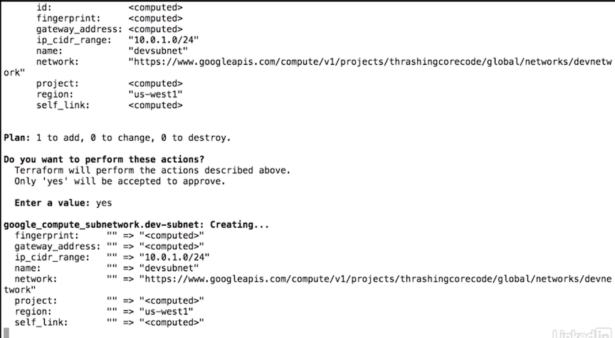

# Build Ecosystem two (Add gcp subnet, instance, k8s cluster and aws instance)

## Deploy gcp subnet and instance 

**`resources.tf`**

```
$ change auto_create_subnetworks from true to false
resource "google_compute_network" "our_development_network" { 
	name = "devnetwork" 
	auto_create_subnetworks = false
} 

# new line 
resource "google_compute_subnetwork" "dev-subnet" {
  ip_cidr_range = "10.0.1.0/24"
  name = "devsubnet"
  network = "${google_compute_network.our_development_network.name}"
  region = "us-west1
}

resource "aws_vpc" "environment-example-two" { 
	cidr_block = "10.0.0.0/16" 
	enable_dns_hostnames = true 
	enable.dns_support = true 
	tags { 
		Name = "terraform-aws-vpc-example-two" 
	}
}

resource "aws_subnet" "subnet1" { 
	cidr_block = "${cidrsubnet(aws_vpc.environment-example-two.cidr_block, 3, 1)}" 
	vpc_id = "${aws_vpc.environment-example-two.id}" 
	availability_zone = "us-west-2a" 
}

resource "aws_subnet" "subnet2" { 
	cidr_block = "${cidrsubnet(aws_vpc.environment-example-two.cidr_block, 2, 2)}" 
	vpc_id = "${aws_vpc.environment-example-two.id}" 
	availability_zone = "us-west-2b" 
}

resource "aws_security_group" "subnetsecurity" { 
	vpc_id = "${aws_vpc.envlronment-example-two.id}" 
   
   ingress { 
   	  cidr_blocks = [ 
   	    "${aws_vpc.environment-example-two.cidr_block}" 
   	  ]
   	
   	from_port = 80 
   	to_port = 80 
   	protocol = "tcp"  
  } 
}

resource "azurerm_resource_group" "azy_network" {
  location = "West US"
  name     = "devresgrp"
}

resource "azurerm_virtual_network" "blue_virtual_network" {
  address_space       = ["10.0.0.0/16"]
  location            = "West US"
  name                = "bluevirtnetwork"
  resource_group_name = "${azurerm_resource_group.azy_network.name}"
  dns_servers         = ["10.0.0.4", "10.0.0.5"]

  subnet {
    name           = "subnet1"
    address_prefix = "10.0.1.0/24"
  }

  subnet {
    name           = "subnet2"
    address_prefix = "10.0.2.0/24"
  }

  tags {
    environment = "blue-world-finder"
  }
}
```

**`$ terraform plan`**


**`$ terraform apply`**



### Deploy first gcp instance 

`servers.tf`

```
resource "google_compute_instance" "firstserver" {
  name = "thefirstserver"
  machine_type = "n1-standard-1"
  zone = "us-west1-a"

  boot_disk {
    initialize_params {
      image = "debian-cloud/debian-8"
    }
  }

  network_interface {
    subnetwork = "${google_compute_subnetwork.dev-subnet.name}"

    access_config {
    }
  }

  metadata {
    foo = "bar"
  }

  service_account {
    scopes = ["userinfo-email", "compute-ro", "storage-ro"]
  }
}
```
**`$ terraform apply`**


### Check created vm instance on gcp


## Deploy aws instance 

### Split the project

**`network.tf` => google network, aws vpc and Azure network and subnet** 

```
resource "google_compute_network" "our_development_network" {
  name = "devnetwork"
  auto_create_subnetworks = false
}

resource "aws_vpc" "environment-example-two" {
  cidr_block = "10.0.0.0/16"
  enable_dns_hostnames = true
  enable_dns_support = true
  tags {
    Name = "terraform-aws-vpc-example-two"
  }
}

resource "azurerm_resource_group" "azy_network" {
  location = "West US"
  name = "devresgrp"
}

resource "azurerm_virtual_network" "blue_virtual_network" {
  address_space = ["10.0.0.0/16"]
  location = "West US"
  name = "bluevirtnetwork"
  resource_group_name = "${azurerm_resource_group.azy_network.name}"
  dns_servers = ["10.0.0.4", "10.0.0.5"]

  subnet {
    name = "subnet1"
    address_prefix = "10.0.1.0/24"
  }

  subnet {
    name = "subnet2"
    address_prefix = "10.0.2.0/24"
  }

  tags {
    environment = "blue-world-finder"
  }
}
```

**`subnetworks.tf` => google subnet and aws subnet** 

```
esource "google_compute_subnetwork" "dev-subnet" {
  ip_cidr_range = "10.0.1.0/24"
  name = "devsubnet"
  network = "${google_compute_network.our_development_network.name}"
}

resource "aws_subnet" "subnet1" {
  cidr_block = "${cidrsubnet(aws_vpc.environment-example-two.cidr_block, 3, 1)}"
  vpc_id = "${aws_vpc.environment-example-two.id}"
  availability_zone = "us-west-2a"
}

resource "aws_subnet" "subnet2" {
  cidr_block = "${cidrsubnet(aws_vpc.environment-example-two.cidr_block, 2, 2)}"
  vpc_id = "${aws_vpc.environment-example-two.id}"
  availability_zone = "us-west-2b"
}

resource "aws_security_group" "subnetsecurity" {
  vpc_id = "${aws_vpc.environment-example-two.id}"

  ingress {
    cidr_blocks = [
      "${aws_vpc.environment-example-two.cidr_block}"
    ]

    from_port = 80
    to_port = 80
    protocol = "tcp"
  }
}
```

**`servers.tf` => aws instance and google servers**

```
resource "google_compute_instance" "firstserver" {
  name = "thefirstserver"
  machine_type = "n1-standard-1"
  zone = "us-west1-a"

  boot_disk {
    initialize_params {
      image = "debian-cloud/debian-8"
    }
  }

  network_interface {
    subnetwork = "${google_compute_subnetwork.dev-subnet.name}"

    access_config {
    }
  }

  metadata {
    foo = "bar"
  }

  service_account {
    scopes = ["userinfo-email", "compute-ro", "storage-ro"]
  }
}


# New aws instance added here
data "aws_ami" "ubuntu" {
  most_recent = true

  filter {
    name = "name"
    values = ["ubuntu/images/hvm-ssd/ubuntu-trusty-14.04-amd64-server-*"]
  }

  filter {
    name = "virtualization-type"
    values= ["hvm"]
  }

  owners = ["099720109477"]
}

resource "aws_instance" "secondserver" {
  ami = "${data.aws_ami.ubuntu.id}"
  instance_type = "t2.micro"

  tags {
    Name = "identifiertag"
  }

  subnet_id = "${aws_subnet.subnet2.id}"
}
```
**`$ terraform apply`**


### Check created aws instance


## Deploying Kubernetes clusters

**`gcp_kubernetes.tf`**

```
resource "google_container_cluster" "kubey" {
  name = "kubeycluster"
  zone = "us-west1-a"
  initial_node_count = "1"

  additional_zones = [
    "us-west1-b"
  ]

  master_auth {
    password = "password-16-or-more-characters"
    username = "username"
  }

  node_config {
    oauth_scopes = [
      "https://www.googleapis.com/auth/compute",
      "https://www.googleapis.com/auth/devstorage.read_only",
      "https://www.googleapis.com/auth/logging.write",
      "https://www.googleapis.com/auth/monitoring",
    ]

    labels {
      this-is-for = "dev-cluster"
    }

    tags = ["dev", "work"]
  }
}
```

**`$ terraform plan`**


**`$ terraform apply`**


### Check created k8s cluster on gcp


### show k8s cluster credentials 

