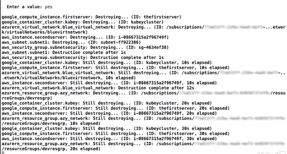

# Terraform Cli command 


## Creation and initialization CLI commands


### `$ terraform init`

terraform init pulls down the specific providers that we need for our project

**`$terraform init`**


Those providers in the `.terraform` directory, under `Plugins`, under the operating specific path, and then there's the executables for it.


So if I delete this I can even kind of start from scratch.** And just go back over to the terminal, and run terraform init again, and it'll pull down those providers and we're right back to where we started from.**


### `$ terraform plan`

**This shows the dif between the existing infrastructure that's in place on whatever platforms,** Amazon, Azure, or GCP, and what state we want it to be in based on our configuration.


### `$ terraform apply`

Terraform apply, **runs a dif and if there are any changes to apply**, it asks us for confirmation where we can say `Yes`, and t**hen continue toward actually deploying all of that infrastructure out into whatever platform**. 

These are our main commands that we would run on a daily basis working with Terraform to get infrastructure deployed out to wherever, whatever multi Cloud or multi platform environment we're deploying it to.

### `$ terraform destory`

Terraform destroy. So this basically works like a terraform apply in complete reverse. **It goes through, does a dif, figures out everything that it's responsible for and what it can destroy listed out.**

**`$terraform destory`**


After enter yes. It goes through and destroys every single resource that we've ever created in Azure, AWS, and Google Compute. 




**This command is a very, very destructive command.** And it's important that it's not issued at whim.


**Usually in a production environment, this one can't even be issued and only terraform plan and terraform apply are actually used on a regular basis to build, change, or remove infrastructure.**

## Workflow and insight CLI commands

### `$terraform validate`

So, basically terraform validate goes through each of the files in the project and confirms that they can be executed against basically compiled with Terraform to deploy whatever infrastructure is in the file

**If mess up some code then run the `$terraform validate`**


### `$terraform fmt`


Terraform format really helps in cleaning up configuration that kind of gets messy.

**If mess up some code format at `network.tf` then run the `$terraform validate`**


```
$terraform fmt
network.tf
```

### `$terraform state`

State is the root command of another number of sub commands, such as list, move and show and how that works, like if I want to see the actual state of a particular resource within the project, I can type terraform state show and then the resource name,

`$terraform state`


```
$ terraform state show azurerm_virtual_network.blue_virtual_network
```


Show the current existing state that Terraform knows of this particular resource.

## `$terraform graph`

This actually has one dependency that we need to go ahead and install called GraphViz

```
$ brew install GraphViz 
```

```
$ terraform graph | dot -Tsvg > graph.svg
```

Terraform graph and then pipe that into the application Tsvg, it's a switch and then output to a file which I'll name SVG since it's gonna create an SVG as the output


**It actually created an SVG file and mapped all of the resources within our project**

## Maintenance and management CLI commands

### `$terraform workspace`

**`$terraform workspace`**


his does is it provides a way to create a workspace, like with workspace new newworkspace.


```
$terraform workspace workspace newworkspace
```


```
$terraform workspace list
  default
* newworkspace
```
```
$terraform workspace select default
Switched to workspace "default.
```
### `$terraform output`

And this basically works with pulling an output variable and returning the assigned value to that output variable based on the state.

**`$terraform output`**


### `$terraform import`

Pass a resource name of an existing resource within a cloud provider, like AWS 


**We can pass variables into `terraform.tfstate` file, then after changed, use  `$terraform import` it will change actual file**

### `$terraform force-unlock`

**Terraform execution is occurring, you can use this to stop the lock and manipulate things in process. **

So this is kinda dangerous to use and it's best if you can let **Terraform complete executions so that state doesn't get into a weird conditional conflict or anything like that.**


### `$terraform refresh`

If certain elements change inside `terraform.tfstate` , the configuration might get out of sync with the actual state file and the actual condition of the cloud. 


### `$terraform taint` and ``$terraform untaint``

```
$terraform taint aws_subnet.subnet1
The resource aws_subnet.subnet1 in the module root has been marked as tainted! 
```

**It will actually do the diff and tell me that it needs to recreate that specific tainted resource.**

**If something had occurred to it and I couldn't refresh the state, or something was just completely out of sync, I can taint that resource and then do a terraform apply and have it recreated in the actual platform**

```
$terraform apply
```


I've just decided that I don't actually want it recreated, you can go in and type terraform untaint `aws_subnet.subnet1` and **basically puts it right back to it's okay, don't destroy it and recreate it.**

```
$terraform untaint aws_subnet.subnet1
The resource aws_subnet.subnetl in the module root has been successfully untainted! 
```

### `$ terraform destory`

**Typing this can basically end everything that you have deployed out that's listed in the state file, in your configurations, and everything**

**This command is going to go out and actually remove and destroy every single resource in the cloud provider**

The destroy command is usually best used when things are in development, or in a system that's not production, and can be destroyed on a daily basis and then recreated


 


