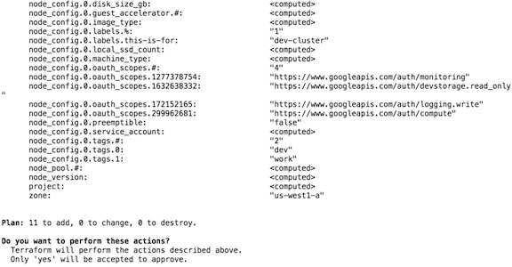
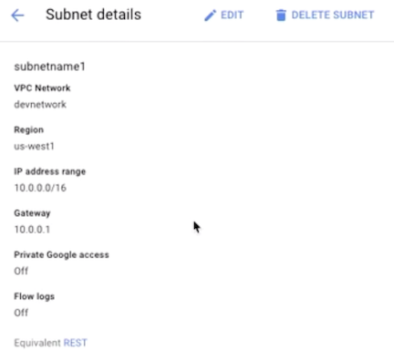
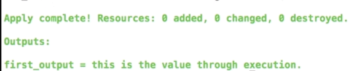
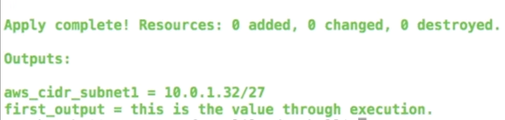
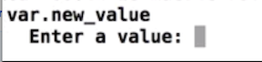
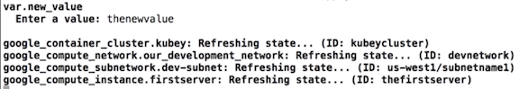
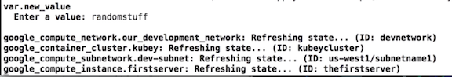

# Terraform Variables

## Variables

**Variables can be passed in as input variables and passed out as output variables to string together various terraform executions into multi-phased executions**

There are three specific types of variables that are available.

* `string variable`
* `map`
* `list`


```
variable "newvariable" { 
	type = "string" 
	default = "thisisvalue" 
} 

variable "maptype" { 
	type = "map" 
	default = { 
		subnetl = "subnetl" 
		subnet2 = "subnet2" 
		subnet3 = "bettersubnetname3" 
	} 
} 
variable "listtype" { 
	type = "list" 
	default = ["iteml", "item2] 
} 
```

### Let's put into practical code

**`variables.tf`**

```
// Google Compute Platform Variables
variable network_name {
  default     = "thenewnet"
  type        = "string"
  description = "Just the network name for the Google Compute Platform."
}

variable gcp_ip_cidr_range {
  default = "10.0.0.0/16"
  type = "string"
  description = "IP CIDR Range for Google VPC."
}

variable aws_ip_cidr_range {
  default = "10.0.1.0/24"
  type = "string"
  description = "IP CIDR Range for AWS VPC."
}

variable subnet_names {
  type = "map"

  default = {
    subnet1 = "subnetone"
    subnet2 = "subnettwo"
    subnet3 = "subnetthree"
  }
}
```

**If I wanna do something at runtime where I assign the variables, I can use the `terraform.tfvars` file to assign some of those.**


**So I've actually used this to reassign the value of `subnet_names` from the `variables.tf` defaults that I have set in there.**


**`terraform.tfvars`**

```
subnet_names = {
  subnet1 = "subnetname1"
  subnet2 = "subnetname2"
  subnet3 = "subnetname3"
}
```

**new `subnetworks.tf` file**

```
resource "google_compute_subnetwork" "dev-subnet" {
  ip_cidr_range = "${var.gcp_ip_cidr_range}"
  name          = "${var.subnet_names["subnet1"]}"
  network       = "${google_compute_network.our_development_network.name}"
}

resource "aws_subnet" "subnet1" {
  cidr_block        = "${cidrsubnet(aws_vpc.environment-example-two.cidr_block, 3, 1)}"
  vpc_id            = "${aws_vpc.environment-example-two.id}"
  availability_zone = "us-west-2a"
}

resource "aws_subnet" "subnet2" {
  cidr_block        = "${cidrsubnet(aws_vpc.environment-example-two.cidr_block, 2, 2)}"
  vpc_id            = "${aws_vpc.environment-example-two.id}"
  availability_zone = "us-west-2b"
}

resource "aws_security_group" "subnetsecurity" {
  vpc_id = "${aws_vpc.environment-example-two.id}"

  ingress {
    cidr_blocks = [
      "${aws_vpc.environment-example-two.cidr_block}",
    ]

    from_port = 80
    to_port   = 80
    protocol  = "tcp"
  }
}
```


**`terraform validate`**

**`terraform apply`**

As always, terraform runs its diff via a plan and then we confirm and it starts to build out all of the infrastructure






**subnetname1 follow the setting from `terraform.tfvars`**


## Output variables

**`variables.tf`**

```
// Google Compute Platform Variables
variable network_name {
  default     = "thenewnet"
  type        = "string"
  description = "Just the network name for the Google Compute Platform."
}

variable new_value {

}

variable newmap {
  type = "map"
}

variable gcp_ip_cidr_range {
  default = "10.0.0.0/16"
  type = "string"
  description = "IP CIDR Range for Google VPC."
}

variable aws_ip_cidr_range {
  default = "10.0.1.0/24"
  type = "string"
  description = "IP CIDR Range for AWS VPC."
}

variable subnet_names {
  type = "map"

  default = {
    subnet1 = "subnetone"
    subnet2 = "subnettwo"
    subnet3 = "subnetthree"
  }
}

// Output variables

output "first_output" {
  value = "this is the value through execution."
}
```
**`$terraform apply`**




### output variable name

```
$terraform output first_output
this is the value through execution
```

Output variables is to like get something that's calculated that you wouldn't know going in but you would want going out of execution,

```
// Output variables

output "first_output" {
  value = "this is the value through execution."
}

output "aws_cidr_subnet1" {
  value = "${aws_subnet.subnet1.cidr_block}"
}
```
**`$terraform apply`**




## Input variables

### input string variable

Get this variable assigned a value for use during execution, is to simply run terraform apply. And because it's a simple string data type, with no default, what will happen is, when we run `terraform apply`, **we will actually be prompted for the value**

**`variables.tf`**

```
variable new_value {

}
```

**`$terraform apply` => prompted for the value**






### input map variable


```
variable new_value {

}

variable newmap {
  type = "map"
}
```

```
$ terraform apply -var 'newmap={ subnetl="sally", subnet2="frank" }' 
```




### input variable from `terraform.tfvars` file

Assigns its variables, goes through it, just like any other **tfvar** where a variable is assigned, and assigns its variables

**`thefilename.tfvars`**

```
$ terraform apply -var-file="thefilename.tfvars"
```