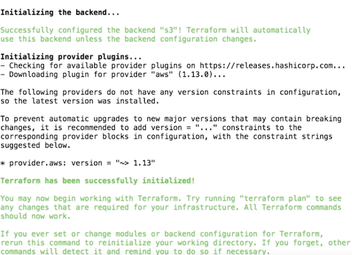
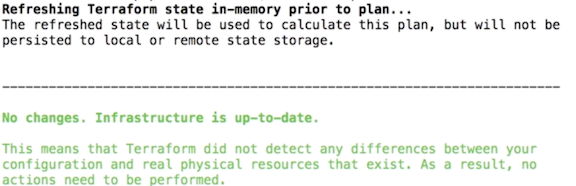
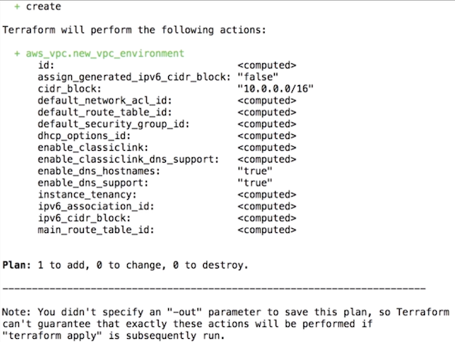

# Patterns and practices

### 1.`connection.tf`

```
provider "aws" {
  region = "us-west-2"
}
```

### 2.`remote-backend.tf`

```
terraform {
  required_version = "~> 0.10"

  backend "s3" {
    encrypt = true
    bucket  = "terraform-backend-dalles"
    key     = "ourdatastore/terraform.tfstate"
    region  = "us-west-2"
  }
}
```

### 3.`variables.tf`

```
variable "vpc_name" {
  description = "The name of the VPC network."
}

variable "s3_terraform_bucket" {}

variable "environment" {}
variable "region" {}
```

### 4.`starter.tfvars`

```
vpc_name = "newvpc"
s3_terraform_bucket = "terraformbucket"
environment = "env"
region = "us-west-2"
```

### `$terraform init` start the terraform backend




### `$terraform plan -var-file="starter.tfvars"`



### 5.add resource

**`network.tf`**

```    
resource "aws_vpc" "new_vpc_environment" {
  cidr_block           = "10.0.0.0/16"
  enable_dns_hostnames = true
}
```

#### `$terraform plan -var-file="starter.tfvars"`



### 6.plan the resource with bash script

#### `starter.sh`

```
#!/usr/bin/env bash

terraform fmt

terraform plan -var-file="starter.tfvars"

echo "yes" | terraform apply -var-file="starter.tfvars"
```

```
$ sudp chmod 700 starter.sh
$ ./starter.sh
```

### 7.Add connection variable into `connection.tf`

```
provider "aws" {
  region = "${var.region}"
}
```

