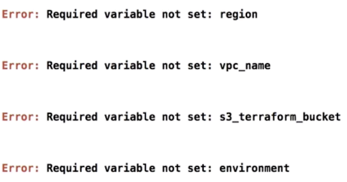
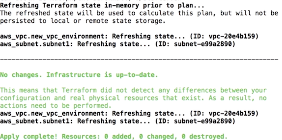

# Workflow

### 1.`network.tf`

```
resource "aws_vpc" "new_vpc_environment" {
  cidr_block           = "10.0.0.0/16"
  enable_dns_hostnames = true
}

resource "aws_subnet" "subnet1" {
  cidr_block        = "${cidrsubnet(aws_vpc.new_vpc_environment.cidr_block, 1, 1)}"
  vpc_id            = "${aws_vpc.new_vpc_environment.id}"
  availability_zone = "${var.availability_zones["zone1"]}"
}
```
### 2.`variables.tf`

```
variable "vpc_name" {
  description = "The name of the VPC network."
}

variable "s3_terraform_bucket" {}

variable "environment" {}
variable "region" {}

variable "availability_zones" {
  type = "map"

  default = {
    zone1 = "us-west-2a"
    zone2 = "us-west-2b"
    zone3 = "us-west-2c"
  }
}
```


#### `$terraform validate`



The issue here is that the `starter.tfvars` files only are assigned their variables at execution time when we execute Terraform and pass in the `starter.tfvars` file what we want is to get those variables assigned at compile time. And the way to do that is to follow a convention-based approach and add a `terraform.tfvars` file

**`starter.tfvars` = `terraform.tfvars` only for pass `$terraform validate`**

`terraform.tfvars`

```
vpc_name = "newvpc"
s3_terraform_bucket = "terraformbucket"
environment = "env"
region = "us-west-2"
```

`$ terraform fmt` get everything in code in good format

`./starter.sh`



## Add new resource and put cide into variable


**`network.tf`**

```
resource "aws_vpc" "new_vpc_environment" {
  cidr_block           = "${var.cidrblock}"
  enable_dns_hostnames = true
}

resource "aws_subnet" "subnet1" {
  cidr_block        = "${cidrsubnet(aws_vpc.new_vpc_environment.cidr_block, 1, 1)}"
  vpc_id            = "${aws_vpc.new_vpc_environment.id}"
  availability_zone = "${var.availability_zones["zone1"]}"
}

resource "aws_subnet" "subnet2" {
  cidr_block        = "${cidrsubnet(aws_vpc.new_vpc_environment.cidr_block, 2, 1)}"
  vpc_id            = "${aws_vpc.new_vpc_environment.id}"
  availability_zone = "${var.availability_zones["zone2"]}"
}
```

**`variables.tf`**


```
variable "vpc_name" {
  description = "The name of the VPC network."
}

variable "s3_terraform_bucket" {}

variable "environment" {}
variable "region" {}

variable "availability_zones" {
  type = "map"

  default = {
    zone1 = "us-west-2a"
    zone2 = "us-west-2b"
    zone3 = "us-west-2c"
  }
}

variable "cidrblock" {
  default = "10.0.0.0/16"
}
```

##### `starter.sh`

```
#!/usr/bin/env bash

terraform fmt

terraform plan -var-file="starter.tfvars"

echo "yes" | terraform apply -var-file="starter.tfvars"
```