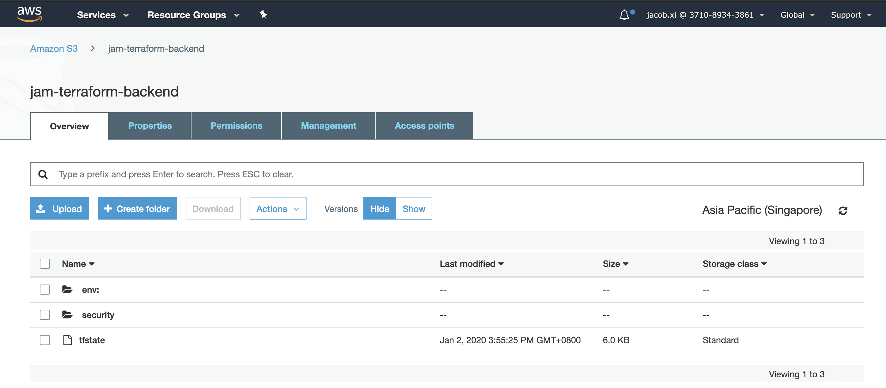
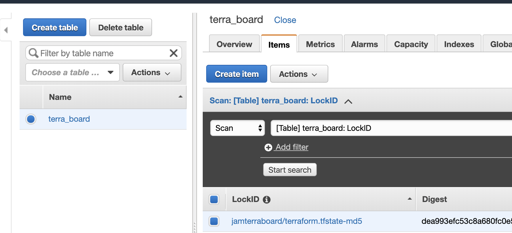

# JAM Terraform S3 Backend with dynamodb


[https://www.terraform.io/docs/backends/types/s3.html](https://www.terraform.io/docs/backends/types/s3.html)


Kind: Standard (with locking via DynamoDB)

Stores the state as a given key in a given bucket on Amazon S3. 

This backend also supports state locking and consistency checking via Dynamo DB, which can be enabled by setting the `dynamodb_table` field to an existing DynamoDB table name.


**Jam K8S**

```
terraform {
  backend "s3" {
    bucket         = "jam-terraform-backend"
    key            = "tfstate"
    region         = "ap-southeast-1"
    dynamodb_table = "terraform_lock"
  }
}
```

**Jam Security**

```
terraform {
  backend "s3" {
    bucket               = "jam-terraform-backend"
    key                  = "tfstate"
    region               = "ap-southeast-1"
    dynamodb_table       = "terraform_lock"
    workspace_key_prefix = "security"
  }
}
```

* `bucket` - (Required) The name of the S3 bucket.
* `key` - (Required) The path to the state file inside the bucket. When using a non-default workspace, the state path will be `/workspace_key_prefix/workspace_name/key`
* `region` / `AWS_DEFAULT_REGION` - (Optional) The region of the S3 bucket.
* `dynamodb_table` - (Optional) The name of a `DynamoDB` table to use for state locking and consistency. The table must have a primary key named LockID. **If not present, locking will be disabled.**
* `workspace_key_prefix`: (Optional) The prefix applied to the state path inside the bucket. This is only relevant when using a non-default workspace. **This defaults to "env:"**






This assumes we have a bucket created called `jam-terraform-backend`. The Terraform state is written to the key `tfstate`.

## S3 Bucket Permissions

Terraform will need the following AWS IAM permissions on the target backend bucket:

```
terraform {
  backend "s3" {
    bucket = "mybucket"
    key    = "path/to/my/key"
    region = "us-east-1"
  }
}
```

### S3 Bucket Permission


Terraform will need the following AWS IAM permissions on the target backend bucket:

* `s3:ListBucket on arn:aws:s3:::mybucket`
* `s3:GetObject on arn:aws:s3:::mybucket/path/to/my/key`
* `s3:PutObject on arn:aws:s3:::mybucket/path/to/my/key`

This is seen in the following AWS IAM Statement:

```
{
  "Version": "2012-10-17",
  "Statement": [
    {
      "Effect": "Allow",
      "Action": "s3:ListBucket",
      "Resource": "arn:aws:s3:::mybucket"
    },
    {
      "Effect": "Allow",
      "Action": ["s3:GetObject", "s3:PutObject"],
      "Resource": "arn:aws:s3:::mybucket/path/to/my/key"
    }
  ]
}
```

### DynamoDB Table Permissions


If you are using state `locking`, Terraform will need the following AWS IAM permissions on the DynamoDB table (`arn:aws:dynamodb:::table/mytable`):

* `dynamodb:GetItem`
* `dynamodb:PutItem`
* `dynamodb:DeleteItem`

This is seen in the following AWS IAM Statement:

```
{
  "Version": "2012-10-17",
  "Statement": [
    {
      "Effect": "Allow",
      "Action": [
        "dynamodb:GetItem",
        "dynamodb:PutItem",
        "dynamodb:DeleteItem"
      ],
      "Resource": "arn:aws:dynamodb:*:*:table/mytable"
    }
  ]
}
```

### Using the S3 remote state


To make use of the S3 remote state we can use the `terraform_remote_state` data source.

```
data "terraform_remote_state" "network" {
  backend = "s3"
  config = {
    bucket = "terraform-state-prod"
    key    = "network/terraform.tfstate"
    region = "us-east-1"
  }
}
```


The `terraform_remote_state` data source will return all of the root module outputs defined in the referenced remote state (but not any outputs from nested modules unless they are explicitly output again in the root). An example output might look like:

## Run the code with remote backend

```
$  terraform apply --target=module.cloudtrail
**Acquiring state lock. This may take a few moments... **

module.cloudtrail.data.aws_caller_identity.current: Refreshing state...
module.cloudtrail.aws_s3_bucket.cloudtrail_bucket: Refreshing state... [id=jam-stage-cloudtrail-logs]
module.cloudtrail.aws_s3_bucket_public_access_block.cloudtrail_bucket: Refreshing state... [id=jam-stage-cloudtrail-logs]
module.cloudtrail.aws_cloudtrail.jam_cloudtrail: Refreshing state... [id=jam-stage-cloudtrail]

**Here nothing changed, just skip**

Apply complete! Resources: 0 added, 0 changed, 0 destroyed.
Releasing state lock. This may take a few moments...

Outputs:

cloudtrail_bucket_name = jam-stage-cloudtrail-logs
cloudtrail_name = jam-stage-cloudtrail
```
