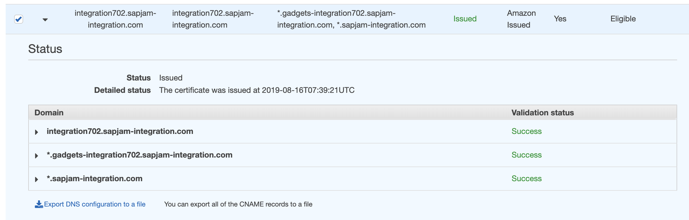

# Jam AWS ACM Certiftcate and DNS


The ACM certificate resource allows requesting and management of certificates from the Amazon Certificate Manager.

It deals with requesting certificates and managing their attributes and life-cycle. This resource does not deal with validation of a certificate but can provide inputs for other resources implementing the validation. It does not wait for a certificate to be issued. Use a `aws_acm_certificate_validation` resource for this.

Most commonly, this resource is used to together with `aws_route53_record` and `aws_acm_certificate_validatio`n to request a DNS validated certificate, **deploy the required validation records and wait for validation to complete**

Domain validation through email is also supported but should be avoided as it requires a manual step outside of Terraform.

**It's recommended to specify `create_before_destroy = true` in a lifecycle block to replace a certificate which is currently in use**.


## `var.tf`

```
variable "DNS_ZONE" {}
variable "JAM_INSTANCE" {}
```

## `main.tf`

```
resource "aws_acm_certificate" "cert" {
  domain_name = "${var.JAM_INSTANCE}.${var.DNS_ZONE}.com"

  subject_alternative_names = ["*.${var.DNS_ZONE}.com", "*.gadgets-${var.JAM_INSTANCE}.${var.DNS_ZONE}.com"]


  validation_method = "DNS"

  tags = {
    Name = "${var.JAM_INSTANCE}.${var.DNS_ZONE}.com"
  }
}
```

### Creating an amazon issued certificate

* `domain_name` - (Required) A domain name for which the certificate should be issued
* `subject_alternative_names`:  (Optional) A list of domains that should be SANs in the issued certificate
* `validation_method` - (Required) Which method to use for validation. `DNS` or `EMAIL` are valid, NONE can be used for certificates that were imported into ACM and then into Terraform.
* `tags` - (Optional) A mapping of tags to assign to the resource.


## `outputs.tf`

```
output "aws_acm_certificate_arn" {
  value = "${aws_acm_certificate.cert.arn}"
}
```

* `arn` - The ARN of the certificate


## Apply Certificate

**This `CERT_ARN` is already created manually**

```
export CERT_ARN=arn:aws:acm:us-east-1...
```


```
$ terraform apply --target=modu
le.certificate
var.route_table_ids
  Enter a value: []

module.certificate.aws_acm_certificate.cert: Refreshing state... [id=arn:aws:acm:eu-cen
tral-1:371089343861:certificate/01279bc2-b7d8-4730-985a-551e85c468f4]

An execution plan has been generated and is shown below.
Resource actions are indicated with the following symbols:
-/+ destroy and then create replacement

Terraform will perform the following actions:

  # module.certificate.aws_acm_certificate.cert must be replaced
-/+ resource "aws_acm_certificate" "cert" {
      ~ arn                       = "arn:aws:acm:eu-central-1:" -> (known after apply)
        domain_name               = "integration702.sapjam-integration.com"
      ~ domain_validation_options = [
          - {
              - domain_name           = "integration702.sapjam-integration.com"
              - resource_record_name  = "_{}.integration7
02.sapjam-integration.com."
              - resource_record_type  = "CNAME"
              - resource_record_value = "_{}.duyqrilejt.a
cm-validations.aws."
            },
          - {
              - domain_name           = "*.gadgets-integration702.sapjam-integration.co
m"
              - resource_record_name  = "_{}.gadgets-inte
gration702.sapjam-integration.com."
              - resource_record_type  = "CNAME"
              - resource_record_value = "_{}.duyqrilejt.a
cm-validations.aws."
            },
          - {
              - domain_name           = "*.sapjam-integration.com"
              - resource_record_name  = "_{}.sapjam-integ
ration.com."
              - resource_record_type  = "CNAME"
              - resource_record_value = "_{}.tljzshvwok.a
cm-validations.aws."
            },
        ] -> (known after apply)
      ~ id                        = "arn:aws:acm:eu-central-1:{}:certificate/
01279bc2-b7d8-4730-985a-551e85c468f4" -> (known after apply)
      ~ subject_alternative_names = [ # forces replacement
          - "*.gadgets-integration702.sapjam-integration.com",
            "*.sapjam-integration.com",
          + "*.gadgets-integration702.sapjam-integration.com",
        ]
        tags                      = {
            "Name" = "integration702.sapjam-integration.com"
        }
      ~ validation_emails         = [] -> (known after apply)
        validation_method         = "DNS"

      - options {
          - certificate_transparency_logging_preference = "ENABLED" -> null
        }
    }

Plan: 1 to add, 0 to change, 1 to destroy.

Do you want to perform these actions?
  Terraform will perform the actions described above.
  Only 'yes' will be accepted to approve.

  Enter a value: no

Apply cancelled.
```

**Complete the DNS validation**

Describe the certificate to get the DNS validation details




