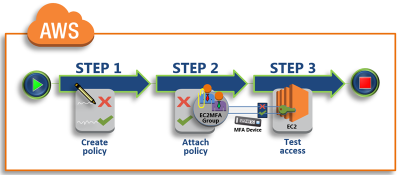

# Jam `Force_MFA` IAM user group

### Rerference:

* [Tutorial: Enable Your Users to Configure Their Own Credentials and MFA Settings](https://docs.aws.amazon.com/IAM/latest/UserGuide/tutorial_users-self-manage-mfa-and-creds.html)



* Step 1: Create a Policy to Enforce MFA Sign-In
* Step 2: Attach Policies to Your Test Group
* Step 3: Test Your User's Access


## `Modules mfa_group`

### `var.tf`

### `main.tf`


```
resource "aws_iam_group" "force_mfa" {
  name = "Force_MFA"
}

resource "aws_iam_policy" "force_mfa_policy" {
  name        = "${aws_iam_group.force_mfa.name}"
  description = "This policy allows users to manage their own passwords and MFA devices but nothing else unless they authenticate with MFA"

  policy = <<POLICY
{
    "Version": "2012-10-17",
    "Statement": [
        {
            "Sid": "AllowViewAccountInfo",
            "Effect": "Allow",
            "Action": [
                "iam:GetAccountPasswordPolicy",
                "iam:GetAccountSummary",       
                "iam:ListVirtualMFADevices"
            ],
            "Resource": "*"
        },       
        {
            "Sid": "AllowManageOwnPasswords",
            "Effect": "Allow",
            "Action": [
                "iam:ChangePassword",
                "iam:GetUser"
            ],
            "Resource": "arn:aws:iam::*:user/$${aws:username}"
        },
        {
            "Sid": "AllowManageOwnAccessKeys",
            "Effect": "Allow",
            "Action": [
                "iam:CreateAccessKey",
                "iam:DeleteAccessKey",
                "iam:ListAccessKeys",
                "iam:UpdateAccessKey"
            ],
            "Resource": "arn:aws:iam::*:user/$${aws:username}"
        },
        {
            "Sid": "AllowManageOwnSigningCertificates",
            "Effect": "Allow",
            "Action": [
                "iam:DeleteSigningCertificate",
                "iam:ListSigningCertificates",
                "iam:UpdateSigningCertificate",
                "iam:UploadSigningCertificate"
            ],
            "Resource": "arn:aws:iam::*:user/$${aws:username}"
        },
        {
            "Sid": "AllowManageOwnSSHPublicKeys",
            "Effect": "Allow",
            "Action": [
                "iam:DeleteSSHPublicKey",
                "iam:GetSSHPublicKey",
                "iam:ListSSHPublicKeys",
                "iam:UpdateSSHPublicKey",
                "iam:UploadSSHPublicKey"
            ],
            "Resource": "arn:aws:iam::*:user/$${aws:username}"
        },
        {
            "Sid": "AllowManageOwnGitCredentials",
            "Effect": "Allow",
            "Action": [
                "iam:CreateServiceSpecificCredential",
                "iam:DeleteServiceSpecificCredential",
                "iam:ListServiceSpecificCredentials",
                "iam:ResetServiceSpecificCredential",
                "iam:UpdateServiceSpecificCredential"
            ],
            "Resource": "arn:aws:iam::*:user/$${aws:username}"
        },
        {
            "Sid": "AllowManageOwnVirtualMFADevice",
            "Effect": "Allow",
            "Action": [
                "iam:CreateVirtualMFADevice",
                "iam:DeleteVirtualMFADevice"
            ],
            "Resource": "arn:aws:iam::*:mfa/$${aws:username}"
        },
        {
            "Sid": "AllowManageOwnUserMFA",
            "Effect": "Allow",
            "Action": [
                "iam:DeactivateMFADevice",
                "iam:EnableMFADevice",
                "iam:ListMFADevices",
                "iam:ResyncMFADevice"
            ],
            "Resource": "arn:aws:iam::*:user/$${aws:username}"
        },
        {
            "Sid": "DenyAllExceptListedIfNoMFA",
            "Effect": "Deny",
            "NotAction": [
                "iam:CreateVirtualMFADevice",
                "iam:EnableMFADevice",
                "iam:GetUser",
                "iam:ListMFADevices",
                "iam:ListVirtualMFADevices",
                "iam:ResyncMFADevice",
                "sts:GetSessionToken"
            ],
            "Resource": "*",
            "Condition": {
                "BoolIfExists": {
                    "aws:MultiFactorAuthPresent": "false"
                }
            }
        }
    ]
}
POLICY
}

# '${}' will cause Terraform to try and evaluate the field as an interpolation function
# Using two $ symbols '$${aws:username}'

resource "aws_iam_group_policy_attachment" "force_mfa_attach" {
  group      = "${aws_iam_group.force_mfa.name}"
  policy_arn = "${aws_iam_policy.force_mfa_policy.arn}"
}
```

* `resource "aws_iam_group" "force_mfa"`
* `resource "aws_iam_policy" "force_mfa_policy" `
* `resource "aws_iam_group_policy_attachment" "force_mfa_attach"`

### `aws_iam_policy`

* [AWS: Allows MFA-Authenticated IAM Users to Manage Their Own Credentials on the My Security Credentials Page](https://docs.aws.amazon.com/IAM/latest/UserGuide/reference_policies_examples_aws_my-sec-creds-self-manage.html)

### `aws_iam_group_policy_attachment`

* [Resource: `aws_iam_group_policy_attachment`](https://www.terraform.io/docs/providers/aws/r/iam_group_policy_attachment.html)

###  `outputs.tf`

```
output "force_mfa_group_arn" {
  value = "${aws_iam_group.force_mfa.arn}"
}

output "force_mfa_group_name" {
  value = "${aws_iam_group.force_mfa.name}"
}
```

## terraform(aws security) main directory

### `provider.tf`

```
provider "aws" {
  access_key = "${var.aws_access_key}"
  secret_key = "${var.aws_secret_key}"
  region     = "${var.region}"
}
```

### `main.tf`

```
module "mfa_group" {
  source = "./modules/mfa_group"
}
```
### `terraform.tfvars`

```
# region for your resource 
region = "us-west-2"

# AWS aws_access_key and aws_secret_key, can be fetched from ~/.aws/credentials
aws_access_key = ""
aws_secret_key = ""
```

### `var.tf`

```
variable "aws_access_key" {}
variable "aws_secret_key" {}
variable "region" {
  default = "us-west-2"
}
```

### `output.tf`

```
output "force_mfa_group_arn" {
  value       = "${module.mfa_group.force_mfa_group_arn}"
  description = "This group arn may need to be attahced to newly created IAM users in both stage and prod account."
}

output "force_mfa_group_name" {
  value       = "${module.mfa_group.force_mfa_group_name}"
  description = "This group name may need to be attahced to newly created IAM users in both stage and prod account."
}
```

## terraform apply the module(default workspace)

```
$ terraform apply --target=module.mfa_group
module.mfa_group.aws_iam_group.force_mfa: Refreshing state... [id=Force_MFA]
module.mfa_group.aws_iam_policy.force_mfa_policy: Refreshing state... [id=arn:aws:iam::371089343861:policy/Force_MFA]
module.mfa_group.aws_iam_group_policy_attachment.force_mfa_attach: Refreshing state... [id=Force_MFA-20191222123018362400000001]
...
```

[Enable MFA-Authenticated IAM Users in AWS](https://github.com/Chao-Xi/JacobTechBlog/blob/master/aws_general/mfa/mfa.md)


