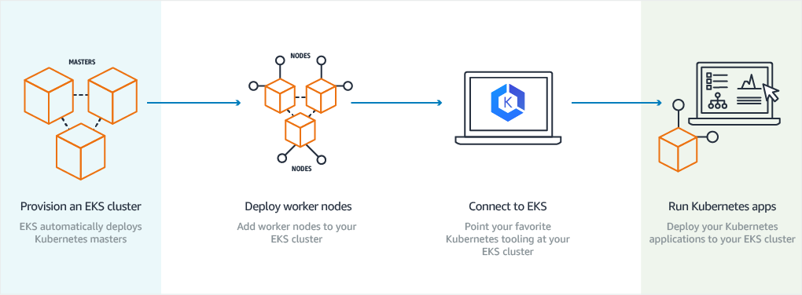
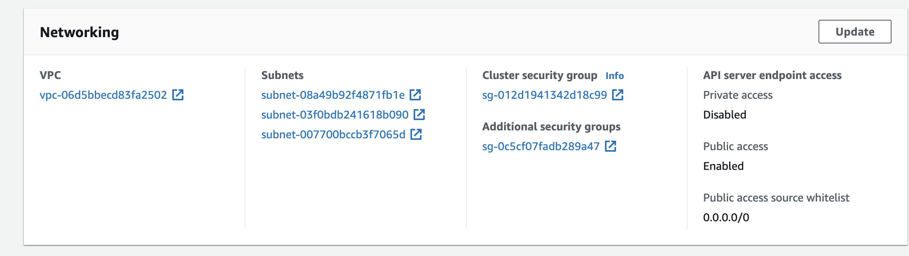
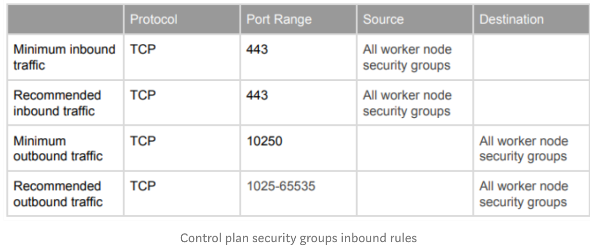
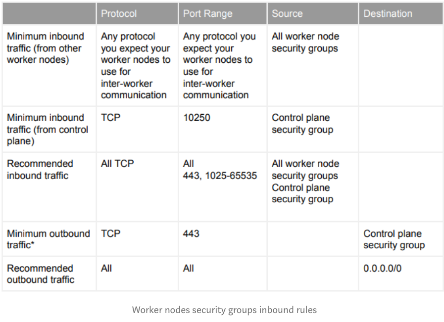
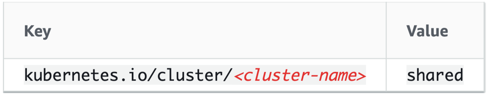
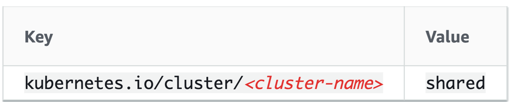
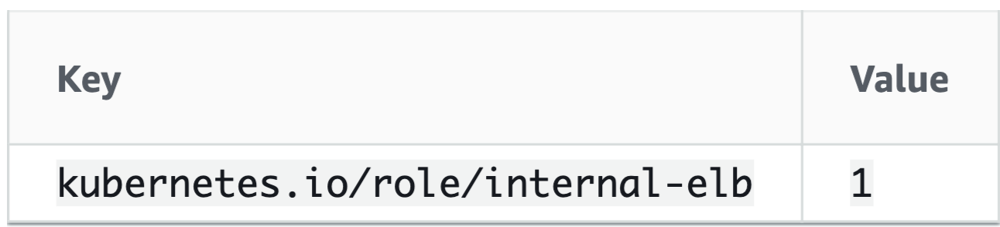
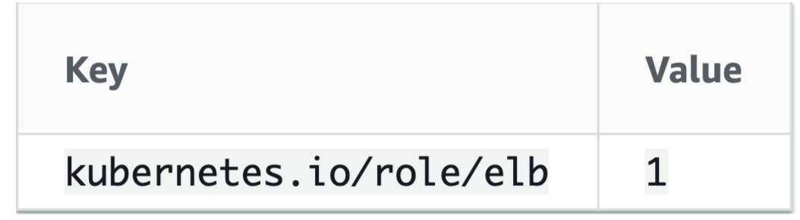

# 5 things you need to know to add worker nodes in the AWS EKS cluster



EKS is a managed kubernetes but customers are still responsible for adding and managing their worker nodes. Now, let’s jump on to the problem statement of this article.

## Problem Statement

AWS has several prerequisites listed in their official documentation for registering worker nodes.

However, in the beginning, it’s quite hard to figure out what all mandatory prerequisites should be met before adding worker nodes. 

**After facing multiple issues while trying to register worker nodes with EKS cluster, especially with private subnet worker nodes, we were finally able to successfully add worker nodes in the cluster**.

## Checklist — for adding worker nodes in the cluster


### 1. Verify cluster subnets

Make sure you are launching worker nodes in the subnet which is a part of your EKS cluster. 

To verify which all subnets you have configured your cluster with, please follow the guidelines below.


Go to `AWS console > EKS > Click` on the cluster and verify subnets attached EKS is configured with. The screenshot is attached for reference.



> If your worker node’s subnet is not configured with the EKS cluster, worker node will not be able to join the cluster.


2.Mandatory Tags for EC2 (worker nodes)

```
a) key                 = "kubernetes.io/cluster/<cluster-name>"
b) value               = "owned"
```

3.Mandatory Tags on subnets

```
c) key              = "kubernetes.io/cluster/<cluster-name>"
d) value            = "shared"
```


4.Security Groups consideration

For security groups whitelisting requirements, you can find minimum inbound rules for both worker nodes and control plane security groups in the tables listed below. In case if you are not familiar with the terminologies like control plane or worker nodes, please visit AWS EKS introduction page here https://docs.aws.amazon.com/eks/latest/userguide/what-is-eks.html

**Control plane security group requirements**




**Worker nodes security group requirements**



5.`User_data` script

**Another important piece is a bootstrap script that bootstraps the worker nodes when they are launched so that they can register with your Amazon EKS cluster.** Worker nodes cannot register properly without this user data.

```
#!/bin/bash -xe

sudo /etc/eks/bootstrap.sh --apiserver-endpoint 'CLUSTER-ENDPOINT' --b64-cluster-ca 'CERTIFICATE_AUTHORITY_DATA' 'CLUSTER_NAME'
```

**Note** — `CLUSTER-ENDPOINT`, `CERTIFICATE_AUTHORITY_DATA` and `CLUSTER_NAME` are just the placeholders above. You can get all of this info on EKS cluster console in AWS.

If all goes well, you should be able to see your worker nodes successfully getting registered with the cluster.


```
root@# kubectl get nodes
NAME                           STATUS   ROLES    AGE   VERSION
ip-SOMEIP.ec2.internal    Ready    <none>   59s   v1.11.5
ip-SOMEIP.ec2.internal    Ready    <none>   2m    v1.11.5
```

**Private subnet** tagging requirement for the internal load balancer


```
a) key       = "kubernetes.io/role/internal-elb"
b) value     = "1"
```

**Public subnet** tagging requirement for the public load balancer


```
a) key       = "kubernetes.io/role/elb"
b) value     = "1"
```

## [Cluster VPC Considerations](https://docs.aws.amazon.com/eks/latest/userguide/network_reqs.html)


### VPC Tagging Requirement

When you create your Amazon EKS cluster, Amazon EKS tags the VPC containing the subnets you specify in the following way so that Kubernetes can discover it:



* **Key**: The `<cluster-name>` value matches your Amazon EKS cluster's name.
* **Value**: **The shared value allows more than one cluster to use this VPC**.

### Subnet Tagging Requirement


When you create your Amazon EKS cluster, Amazon EKS tags the subnets you specify in the following way so that Kubernetes can discover them:




* Key: The `<cluster-name>` value matches your Amazon EKS cluster.
* Value: The **shared** value allows more than one cluster to use this subnet.


### Private Subnet Tagging Requirement for Internal Load Balancers


Private subnets in your VPC should be tagged accordingly so that Kubernetes knows that it can use them for internal load balancers:




### Public Subnet Tagging Option for External Load Balancers


Public subnets in your VPC may be tagged accordingly so that Kubernetes knows to use only those subnets for external load balancers, instead of choosing a public subnet in each Availability Zone (in lexicographical order by subnet ID):


